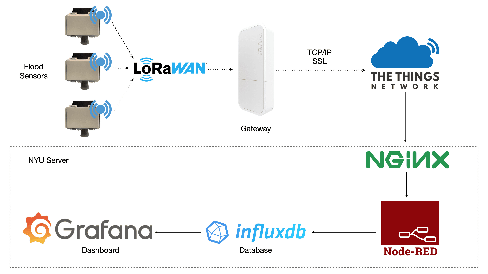

# Flood Sensor Documentation

    

 

| [Suggest a sensor location](https://docs.google.com/forms/d/e/1FAIpQLScIM4Nu0z6l5HO8uzl9k4RGRSzU549LakNMNijnjGAHodFg9w/viewform) | [_@_ Contact us](mailto:info@floodnet.nyc) |
| :----------: | :----------: |

 

This repository houses information regarding the build, deployment, and maintenance of the FloodnNet project's flood sensor.
 

- [Flood Sensor Documentation](#flood-sensor-documentation)
  - [About FloodNet](#about-floodnet)
  - [How to build a flood sensor](#how-to-build-a-flood-sensor)
  - [How to deploy a flood sensor](#how-to-deploy-a-flood-sensor)
  - [How to maintain a flood sensor](#how-to-maintain-a-flood-sensor)
  - [Additional resources](#additional-resources)
 

## About FloodNet
FloodNet is a partnership between academic researchers at New York University and the City University of New York, and NYC municipal agencies (NYC Mayor’s Office of Climate & Environmental Justice and Mayor’s Office of the Chief Technology Officer), working in consultation with community organizations.

_Note:_ This repository is relevant only to the flood sensors i.e. the end-device sensing component within a larger sensor network infrastructure. For more details about the complete network infrastructure(figure below) refer to the FloodNet [documentation website](https://floodnet-nyc.github.io//real-time-data-pipeline/#31-data-flow-pipeline-overview). 

Further, [Gateway](https://github.com/floodnet-nyc/floodnet-gateway) and [NodeRED](https://github.com/floodnet-nyc/floodnet-nodered) repositiories are linked in the additional resources section for reference. 

 

 
 

## How to build a flood sensor
This section contains the necessary resources to build a flood sensor from the raw materials state to a final product. 

### BOM
  - The total sensor cost per unit is below $200. 
  - When mounting hardware is included the total cost of the sensor plus mounting hardware comes around $210. 
  - A list of complete bill of materials for the sensor and mounting hardware is available in the [BOM](https://github.com/floodnet-nyc/flood-sensor/tree/main/hardware/BOM.md) document.

### Sensor build instructions with Quality Assurance Procedures
  - The step-by-step sensor build instructions including images and quality assurance steps are detailed in the [Sensor build with Quality Assurance Procedures](https://floodnet-nyc.github.io//quality-management/sensor-assembly-qap/) page on the FloodNet's documentation website to ensure high quality sensor builds with consistency.

### Installing sensor software
  - After the sensor assembly stage is the installation of the sensor firmware. To install the sensor's firmware follow the steps detailed in the of the firmware folder's [README.md](https://github.com/floodnet-nyc/flood-sensor/tree/main/firmware/readme.md). 

### Quality Control and testing
  - After the production/assembly stage, quality control (QC) tests are performed on every sensor to validate the data quality. 
  - In-lab testing and Quality Control checks are detailed in the FloodNet's [Quality Control page](https://floodnet-nyc.github.io//quality-management/quality-control/) on the documentation website.

### Troubleshooting

 

## How to deploy a flood sensor

The FloodNet sensors are deployed on street sign poles, over the sidewalk, following the permission from NYC to do so. This section details how to identify a location, choose a good mounting option, and finally, deploy a flood sensor.

### Deployment location identification strategy
  - Sensor deployment locations are determined in consultation with government and community partners, using criteria that include estimated risks of flood hazard and impact, social vulnerability, and spatial coverage.
  - Further, multiple assessment strategies combined contribute to the sensor locations identification process, including but not limited to - community engagement, flood maps, historically flood-prone neighborhoods, and city agency recommendations.
  - The [Flood Hotspots Identifacation manual](https://github.com/floodnet-nyc/flood-sensor/blob/main/deployment/hotspot%20identification/flood-hotspots-identification.md) details the strategies mentioned above.

### Flood sensor deployment steps

 

## How to maintain a flood sensor
The maintenance maual is the [README.md](https://github.com/floodnet-nyc/flood-sensor/tree/main/maintenance/README.md) document which contains the information needed for sensor maintenance runs and visits. Below are a list of common maintenance visit reasons listed and linked to the recommended fixes detailed on the manual. 

### Common maintenance visit reasons
  - Trending down battery profile due to:
    - Not enough sunlight 
    - Battery does not charge
  - Brownouts
  - Antenna Issues
  - Manual Firmware updates
  - Operational Issues:
    - Inaccurate or unexpected sensor measurements
    - No sensor measurements
  - Sensor swapout in the case of a failure

## Additional resources

------------------------------------------------------------------------------------------------------------------------
Shield: [![CC BY-NC-SA 4.0][cc-by-nc-sa-shield]][cc-by-nc-sa]

This work is licensed under a
[Creative Commons Attribution-NonCommercial-ShareAlike 4.0 International License][cc-by-nc-sa].

[![CC BY-NC-SA 4.0][cc-by-nc-sa-image]][cc-by-nc-sa]

[cc-by-nc-sa]: http://creativecommons.org/licenses/by-nc-sa/4.0/
[cc-by-nc-sa-image]: https://licensebuttons.net/l/by-nc-sa/4.0/88x31.png
[cc-by-nc-sa-shield]: https://img.shields.io/badge/License-CC%20BY--NC--SA%204.0-lightgrey.svg
