# This repository is updated for TTN v3 download this library and also remove the old lmic library from arduino libraries  and download the latest library from[here](https://github.com/mcci-catena/arduino-lmic)
# FloodSense Sensor Technical Documentation
[This repository](https://github.com/floodsense/floodsense_sensor) contains the source code for the Floodsense sensor which uses ultrasonic sensor technology to detect floods and send the data over LoRa using LoRaWAN protocol. [Here](https://github.com/floodsense/sensor_experiments) is the experiments repo containing technical documentation, analysis and additional support related to this library.

**Table of Contents:**

  * [Introduction](#introduction)
  * [Hardware](#hardware)
    * [Sensor Overview](#sensor-overview)
    * [Sensor Design](#sensor-design)
    * [Build Instructions](#build-instructions)
    * [Deployment](#deployment)
  * [Software](#software)
    * [Installation](#installation)
      * [Necessary Software](#necessary-software)
      * [FloodSense Sensor Library](#floodsense-sensor-library)
      * [Additional Libraries](#additional-libraries)
    * [Using FloodSense Library](#using-floodSense-library)
    * [Sensor Configuration file](#sensor-configuration-file)
    * [LoRa](#lora)
    * [Changing Sensor Configuration via Downlink](#changing-sensor-configuration-via-downlink)
      * [Changing dutycycle](#changing-dutycycle)
      * [Changing sensor mode](#changing-sensor-mode)
      * [Changing sampling rate](#changing-sampling-rate)
      * [Changing number of sensor readings per measurement](#changing-number-of-sensor-readings-per-measurement)
      * [Changing multiple parameters via single downlink](#changing-multiple-parameters-via-single-downlink)
    * [The Things Network](#the-things-network)
      * [The Things Network Payload Decoder](#the-things-network-payload-decoder)
      * [The Things Network Credentials](#the-things-network-credentials)
    * [Ultrasonic Sensor](#ultrasonic-sensor)
      * [Ultrasonic Sensor Modes](#ultrasonic-sensor-modes)
    * [SD Card logging and RTC](#sd-card-logging-and-rtc)
  * [Appendix](#appendix)
    * [Solar Influence on Ultrasonic Sensor](#solar-influence-on-ultrasonic-sensor)
      * [Steps to reduce Solar Influence on Ultrasonic Sensor readings](#steps-to-reduce-solar-influence-on-ultrasonic-sensor-readings)
    * [Ultrasonic range sensor consistency](#ultrasonic-range-sensor-consistency)
    * [Adafruit Sleepydog Library Deep-Sleep crash fix](#adafruit-sleepydog-library-deep-sleep-crash-fix)
    * [FloodSense Library Structure and Scope](#floodsense-library-structure-and-scope)


## Introduction
Of the myriad impacts that are predicted to accompany climate change, flooding is expected to have an out-sized influence on public health, infrastructure, and mobility in urban areas. In New York City, for example, sea level rise and an increase in the occurrence of high intensity rain storms (which convey large volumes of water to drains, leading to backups and overflows) have led to a dramatic increase in flood risk, particularly in low-lying and coastal neighborhoods. The physical presence of standing water on streets and sidewalks can impede mobility and restrict access to transportation. Additionally, urban flood water contains a diverse array of contaminants, including industrial and household chemicals, fuels, and sewage.  Access to real-time information on flooding can improve resiliency and efficiency by allowing residents to identify navigable transportation routes and make informed decisions to avoid exposure to floodwater contaminants.

One of the goals of the [FloodSense](https://www.floodnet.nyc/) project is to develop a flood sensor that overcomes common sensor challenges, as well as the digital infrastructure necessary to log, process, and present the data in combination with other publicly available information, such as rainfall data, 311 flooding complaints, and social media feeds. This document specifies the sensor design, building instructions, initial deployment and schematics for technology transfer of the sensor development for the FloodSense project at 370 Jay Street, 13th Floor.

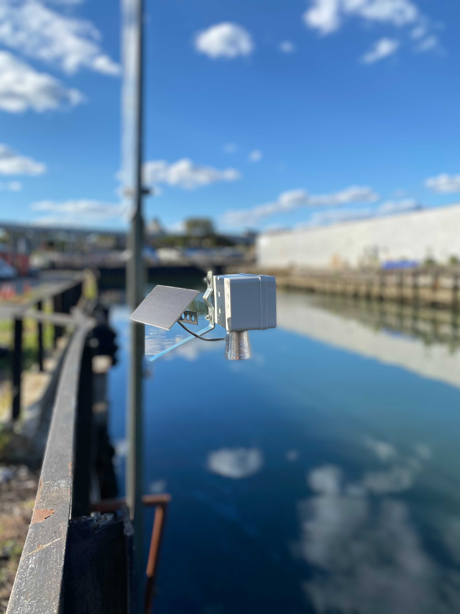

## Hardware
The hardware section contains sensor design, build instructions, explanation of deployment scenarios and essential information regarding the sensor operation.

### Sensor Overview
The sensor uses a high-end ultrasonic range sensor, the MB7389 from Maxbotix, which provides range detection from 30-500 cm with an accuracy of ±3 mm. The sensor can be pole or wall mounted and is battery powered with solar energy harvesting for extended operation. Connectivity is provided via a LoRaWAN and the sensor will typically upload data every 5 minutes. Further the sensor uses averaging methods to reduce noise. These sensor configurations can be modified in real-time via downlinks using LoRaWAN.

### Sensor Design
The sensor is of the dimensions 5.1" x 3.1" x 2.8". Using metal straight brace brackets the sensor can be mounted onto poles, walls and additional mounting hardware depending on the scenario. This iteration of the sensor consists of a low-power microcontroller with integrated LoRaWAN radio, a 2200 mAh battery, a solar controller and 1.2W solar panel, and a Maxbotix industrial grade range sensor (see Figure 2), and has a price point around $240 for materials. For ease of deployment in diverse locations, the sensor does not rely on existing urban power and connectivity infrastructure. A complete list of BOM with suppliers is mentioned below.


| Item                                                        | Cost per unit|
| ----------------------------------------------------------  |------|
| [Feather M0](https://www.adafruit.com/product/3178)        | $34.95|
| [2200mAh battery](https://www.adafruit.com/product/1781)   | $9.95|
| [Connector board](https://www.adafruit.com/product/2926)   | $14.95|
| [RTC battery](https://www.adafruit.com/product/380)        | $0.95|
| [SD feather wing](https://www.adafruit.com/product/2922)   | $8.95|
| [Duponts](https://www.amazon.com/Generic-Breakaway-Headers-Length-Centered/dp/B015KA0RRU/ref=sr_1_2?dchild=1&keywords=long+pin+dupont&qid=1593041308&sr=8-2)|$0.7    |
| [Voltaic 1.2W solar panel](https://voltaicsystems.com/1-watt-6-volt-solar-panel-etfe/) |$14.00|
| [Solar board](https://www.amazon.com/Adafruit-Lithium-Polymer-Charger-ADA390/dp/B00OKCSK88/ref=sr_1_24?dchild=1&keywords=ADA390&qid=1599062478&s=electronics&sr=1-24)|$22.90|
| [Ultrasonic sensor](https://www.robotshop.com/en/maxbotix-maxsonar-weather-resistant-ultrasonic-range-finder.html) | $99.95|
| [Mounting headers](https://www.amazon.com/gp/product/B07KM5B3PT/ref=ppx_yo_dt_b_asin_title_o06_s00?ie=UTF8&psc=1) | $0.9|
| [Panel mount](https://www.amazon.com/uxcell-Aluminum-Brackets-Profile-Connectors/dp/B07SGDXJWN/ref=pd_sim_60_1/142-2831092-9952011?_encoding=UTF8&pd_rd_i=B07SGDXJWN&pd_rd_r=a68c7b36-c091-406e-a9ee-7e69af613cbe&pd_rd_w=3Tq0h&pd_rd_wg=EmJXn&pf_rd_p=4e0e1c4f-27a6-4ddd-82e5-121637280059&pf_rd_r=R1FTFNTPHYW9YGYM2JPC&psc=1&refRID=R1FTFNTPHYW9YGYM2JPC)| $4.69|
| [Housing (5.1"x3.1"x2.8")](https://www.amazon.com/dp/B07FFM3T1P/ref=dp_iou_view_product?ie=UTF8&psc=1)| $9.99 |
| [16GB SD card](https://www.amazon.com/SanDisk-Ultra-SDSQUNS-016G-GN3MN-UHS-I-microSDHC/dp/B074B4P7KD/ref=sr_1_4?dchild=1&keywords=sd+card&qid=1593044968&refinements=p_89%3ASamsung%7CSanDisk%2Cp_36%3A1253503011%2Cp_72%3A1248879011&rnid=1248877011&s=pc&sr=1-4)| $5.50|
| [Mounting plate](https://www.amazon.com/dp/B07G4XYQXX/ref=sspa_dk_detail_2?pd_rd_i=B07G4XYQXX&pd_rd_w=88b7Q&pf_rd_p=a64be657-55f3-4b6a-91aa-17a31a8febb4&pd_rd_wg=WHW9D&pf_rd_r=P2VY3R2D6VFS2DFV2BD2&pd_rd_r=10b85dcb-8399-480c-be22-23432f9786aa&spLa=ZW5jcnlwdGVkUXVhbGlmaWVyPUFTNE43U09LQkRIRkEmZW5jcnlwdGVkSWQ9QTAzMzEyNTcyRzlLVlFNRjBPRzAwJmVuY3J5cHRlZEFkSWQ9QTA4NTczMjJTSzE3NlBDT1RJSCZ3aWRnZXROYW1lPXNwX2RldGFpbF90aGVtYXRpYyZhY3Rpb249Y2xpY2tSZWRpcmVjdCZkb05vdExvZ0NsaWNrPXRydWU&th=1) | $0.99|
| [Lock nut](https://www.amazon.com/Lock-nut-female-75inch-locknut-Spacer/dp/B07QM7S33K/ref=sr_1_2?dchild=1&keywords=3%2F4inch+lock+nut&qid=1593126413&sr=8-2)| $5.99|
| Grand Total | $235.36|

All components are readily available from internet suppliers, primarily NYC based. Figure below labels the core components within the prototype sensor.

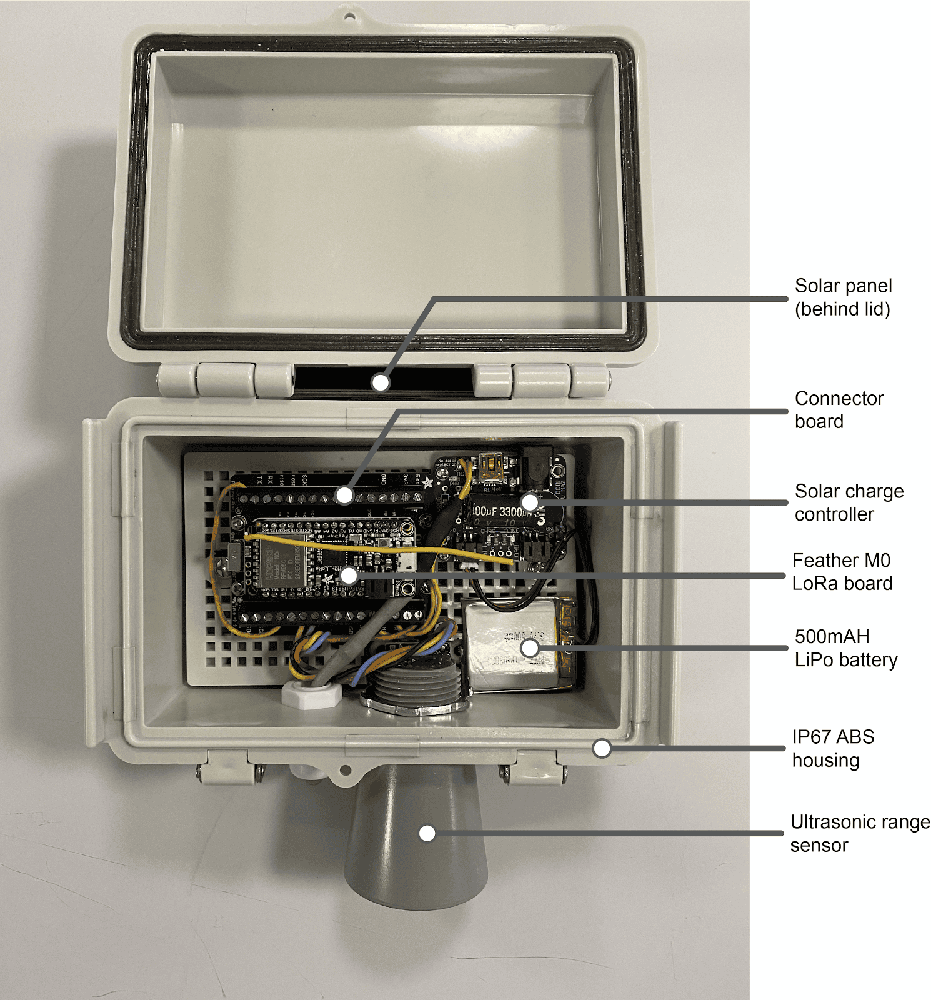
<br /> <br />

The housing requires drilling using a step drill bit to accommodate the ultrasonic sensor and external solar wiring gland. Solar panel fixing can be done using weatherproof plastic glues or industrial mounting tape. The building instructions have been explained in the following section

### Build Instructions

The following are the build instructions listed as steps:

#### Step 1: Microcontroller Assembly

The Feather m0 LoRa module does not come with a built-in antenna for LoRa. A simple single core standard wire can be used as an antenna when cut down to right lengths according to the desired frequencies
  - 433 MHz - 6.5 inches, or 16.5 cm
  - 868 MHz - 3.25 inches or 8.2 cm
  - 915 MHz - 3 inches or 7.8 cm

Using single core wire as antenna:


<br />

And the other components used are SD feather wing, male long headers and a coin cell battery.


<br />

Solder the antenna onto the ANT pad on the very right hand edge of the sensor. Using the male headers solder the SD feather wing onto the feather m0 module and mount this onto the connector board and fix it onto the mounting board of the housing.


<br />

Finally the coin cell and SD card goes into the SD feather wing.

#### Step 2: Drilling holes for Sensor and Solar Panel

Two holes need to be drilled into the housing. The first hole is to mount the Ultrasonic sensor and this needs to be at the center of the mounting side for constant and reliable readings. The second hole is next to the first one to accommodate the wire connecting the solar panel.


<br />

#### Step 3: Mounting MCU into the housing
Mount the complete MCU setup from step 1 into the housing using screws.

#### Step 4: Mounting the Ultrasonic sensor

Connect the ultrasonic sensor to the MCU and screw it using a ¾” lock nut.


<br />

#### Step 5: Mounting the Solar Panel

Since the solar panel sits outside, it is always a good measure to use heat sinks and potting for waterproofing the contacts on the back.


<br />

Now run the wire back from the solar panel through the smaller hole and use a PG-7 cable gland to waterproof the opening.


<br />

Further, solder the solar panel onto the solar battery charger and stick the solar battery charger onto the side wall to make space for the battery.

#### Step 6: Final assembly of the sensor

Using an aluminum corner bracket, the solar panel is mounted at an angle for optimal amount of solar radiation.


<br />

Now we are ready for battery plug in!


<br />

**Connections:**
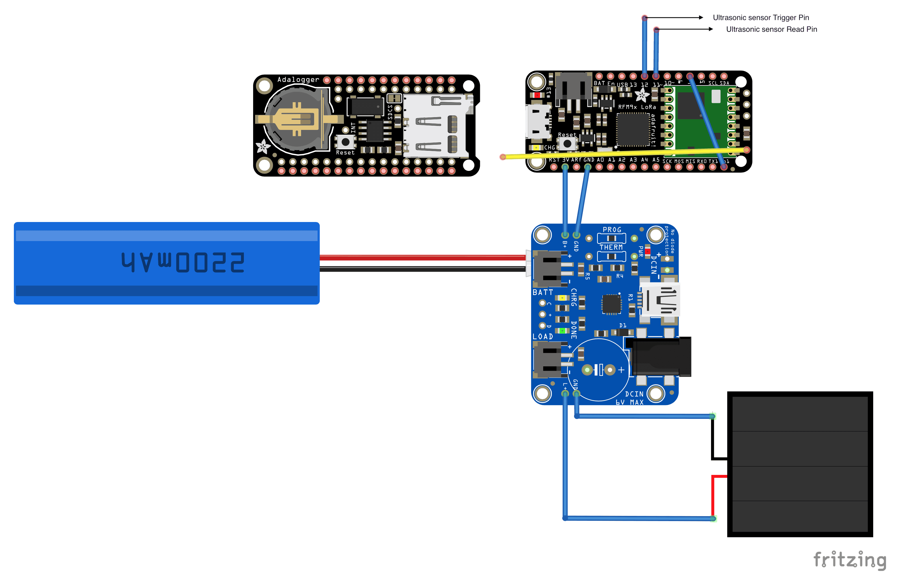
<br />

### Deployment
This section explains different deployment scenarios and possibilities.


<br />

The sensor's small size, weight, and lack of reliance on existing power sources opens up many opportunities for sensor deployments. Street signposts provide an ideal mounting condition with holed steel U-Bar for variable mount heights.

Through conversations with the NYCDOT Assistant Commissioner of Traffic Control & Engineering, permissions were granted for sensor deployments on traffic signs. The following figure shows the visual documentation sent to NYCDOT, providing the sensor info and mounting conditions. The NYCDOT conditions were that the sensor should be mounted at least 7ft from the ground to reduce the chance of vandalism. Between the creation of this document and the deployment, the mounting hardware changed slightly.

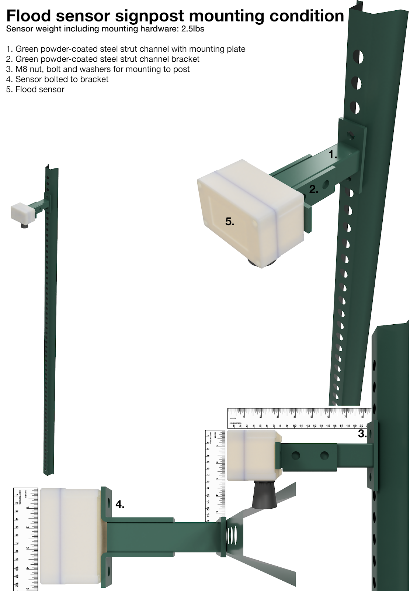
<br />

Furthermore, a longer cable running to the solar panel can enable mounting of the solar panel separately to the sensor and this is shown in the following figure:

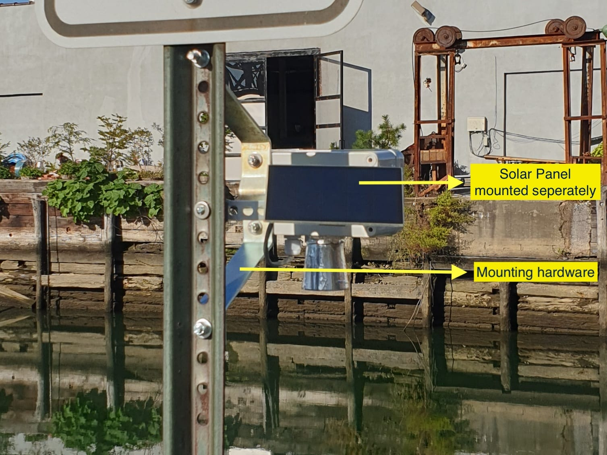
<br />

## Software

### Installation
All the following three sub-sections are needed to be completed in order to satisfy the requirements to run the software for this sensor. Furthermore, in order to utilize the complete functionalities of the sensor, a back-end support is needed.

#### Necessary Software
For simplicity, Arduino IDE has been used in the documentation but other IDEs can also be used. Arduino IDE, can be downloaded from [Arduino's website](https://www.arduino.cc/en/software). The Arduino IDE is used for uploading the firmware to the microcontroller.

#### FloodSense Sensor Library
Download the FloodSense Sensor Library from [here](https://github.com/floodsense/floodsense_sensor). This library contains the source code "src" folder, which is the firmware and contains all the necessary files for this sensor to work.

**Method 1:**
1. Find Arduino libraries folder
2. Clone the library folder into the Arduino>libraries

[**Method 2:**](https://www.arduino.cc/en/guide/libraries)
1. In Arduino IDE, go to: Sketch> Include Library> Add .ZIP Library..

  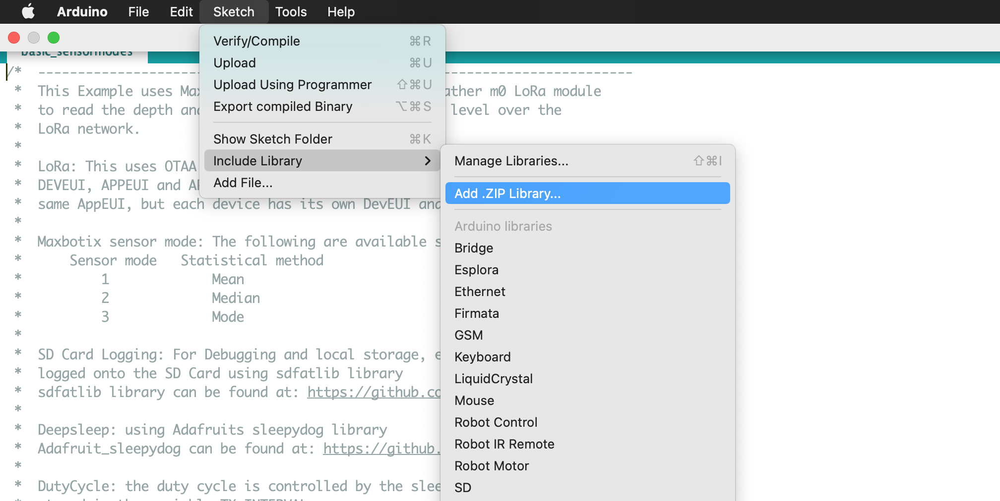
<br />
2. Select the downloaded ZIP folder of this library from your computer

#### Additional Libraries
The following libraries are also required to be installed:
1. Arduino-Lmic library: https://github.com/mcci-catena/arduino-lmic
2. SDFat library: https://github.com/jbeynon/sdfatlib
3. Adafruit's sleepydog library: https://github.com/adafruit/Adafruit_SleepyDog
4. Adafruit's RTClib: https://github.com/adafruit/RTClib

### Using FloodSense Library
The following is an example from the examples folder, which demonstrates how this library functionality can be used only with few lines of code:

```cpp

#include <Floodsense_sensor.h>  

void setup() {
  delay(5000);
  Serial.begin(9600);
  Serial.println("Starting");

  setup_maxbotix(2, 150, 5);  // sensor mode 2(Median), 150ms sampling rate (time between readings), 5 readings per measurement
  setup_featherWing();        // set up SD card and RTC. Sets date and time everytime compiled.
  lmicsetup(300);             // uplink frequency 300 seconds - controls duty cycle
}

void loop() {
  lorawan_runloop_once();
}
```

The main loop contains a single function `lorawan_runloop_once()` which runs all the time handling LoRa, Low Power Sleep, Sensors and everything else and is further explained in the section [Lmic library and LoRaWAN Timing](#lmic-library-and-lorawan-timing).

The `void setup()` sets up the sensor's serial communication(used for debugging), Ultrasonic sensor(`setup_maxbotix()` function), FeatherWing (`setup_featherWing()` function) and finally lmic library handles the LoRaWAN and is setup using `lmicsetup(usigned int packet_interval)` function.

#### Sensor Configuration file
The Sensor Config file, `sensorcfg.h` contains important pin definitions, flags and parameters that can be changed during runtime. However some parameters are fixed for a given architecture and shouldn't be modified during runtime such as Pins, Card and Chip Selects etc.

Here below is a list of parameters that can be changed during the run-time of the sensor:
- Duty Cycle
- Ultrasonic Sensing Modes

### LoRa

This library uses the [Arduino-lmic](https://github.com/mcci-catena/arduino-lmic) library to handle the LoRa communication. The Things Network has a LoRaWAN [compliance](https://www.thethingsnetwork.org/docs/lorawan/duty-cycle.html). This means every radio device must be compliant with the regulated duty cycle limits. To program the node to stay within the limits, an [air-time calculator](https://avbentem.github.io/airtime-calculator/ttn/us915) can be used.

The LoRa communication consists of uplinks and downlinks. This sensor uses uplinks to update the sensor data and also to send sensor configuration packets which is useful to monitor the current cfg of the sensor remotely. The downlinks generated from the back-end which enables to change the sensor cfg remotely.

#### Uplink Packet Format

| Error flags  | Battery Level | Ultrasonic reading  |
|--------------|---------------|---------------------|
|   1 byte     |    2 bytes    |        2 bytes      |

**Cfg packet format:**

| Error flags  | Sensor Mode | Sensor Sampling Rate | Sensor Number of Readings |
|--------------|---------------|---------------------|---------------------|
|   1 byte : 255 or 0xFF     |    1 byte   |      2 bytes         |        1 bytes            |

**Error Flags(empty flags are for future use):**

|     bit 7    |     bit 6   |     bit 5    |     bit 4    |     bit 3    |     bit 2    |     bit 1    |     bit 0    |
|   ----       |   ----      |     ----     |     ---      |      ---     |      ---     |       ---    |      ---     |
|      Used only for CFG update (all other bits are high)         |             |              |              |              |              |              | SD error flag|


#### Downlink Packet Format

|Duty Cycle in seconds | Sensor Mode  |  Sampling Rate| Number of readings per measurement |
|----------------------|--------------|---------------|  --------------------------------- |
| 2 bytes              |   1 byte     |    2 bytes     |          1 byte                    |

#### Lmic library and LoRaWAN Timing
The lmic library can be setup using the `lmicsetup(usigned int packet_interval)` function. The following is the code block for the same function which explains the lmic configuration:
```cpp
void lmicsetup( unsigned int packet_interval = 300) {       //Future setup variables
  Serial.println(F("Setting up LoraWAN..."));

  digitalWrite(13, HIGH);
  // LMIC function to initialize the run-time environment
  os_init();    
  // Reset the MAC state. Session and pending data transfers will be discarded.                      
  LMIC_reset();                       
  //Setting a high clock error causes the RX windows to be opened earlier than it otherwise would be. This causes more power to be consumed.
  // LMIC_setClockError(MAX_CLOCK_ERROR * 1 / 100);    
  // Disable link check validation (automatically enabled).
  LMIC_setLinkCheckMode(0);       // Link check mode is enabled by default and is used to periodicall verify network connectivity.  
  LMIC_setDrTxpow(DR_SF7, 14);    // Data rate spreading factor 7 is selected. Lower the spreading factor faster the transmit. This leads to longer battery life and less gateway utilization.
  LMIC_selectSubBand(1);          // Saves join time in the US, overridden when working over other regions
  digitalWrite(13, LOW);
  Serial.println("Setup Ready!");
  TX_INTERVAL = packet_interval;    // Controls the duty cycle
  // An initial start job (sending automatically starts OTAA too)
  Serial.println("Starting first job in setup");
  prepare_packet();
  do_send(&sendjob);
}
```

Scheduling uplinks using LoRaWAN is time critical. The lmic library which manages and handles this LoRaWAN communication has different modes, refer to [lmic-documentation](https://github.com/mcci-catena/arduino-lmic/blob/master/doc/LMIC-v3.3.0.pdf) for more details. All the application code in run is so-called jobs which are excecuted on the main thread by the run-time scheduler function `os_runloop()`. An additional per job control struct, `osjob_t` identifies and stores the context information. **Jobs must not be long running in order for seamless operation**.

The function, `lorawan_runloop_once()` defined in the file `lorawan.cpp` contains the `os_runloop()`.
```cpp
void lorawan_runloop_once() {
  os_runloop_once();
  if ( !os_queryTimeCriticalJobs(ms2osticksRound((TX_INTERVAL * 1000) - 1000 )) && TX_COMPLETED == true) {
    TX_COMPLETED = false;
    // This means the previous TX is complete and also no Critical Jobs pending in LMIC
    Serial.println("About to go to deep sleep and no critical jobs");
    gotodeepsleepnow(TX_INTERVAL);
    Serial.println("Im awake and TX_COMPLETED is set to false");
    // Prepare a packet in relaxed setiing
    prepare_packet();
    os_setCallback(&sendjob, do_send);
  }
}
```

The function, `os_queryTimeCriticalJobs()` checks for any critical jobs before sleep. This function checks for any uncompleted jobs before moving onto other tasks and is necessary for smooth operation since the MCU is single thread. Once that all the critical jobs have been completed, the sensor goes to deep-sleep to save power.


<br />

The function, `prepare_packet()` prepares uplink packet that is needed to be transmitted using LoRa.

And once when the packet is ready, in order to send an uplink, a job is scheduled using the `os_setCallback()` function. This function prepares an immediately runnable job and can be called at any time, including from interrupt
handler contexts.

#### Sleep and Low Power

The function `gotodeepsleepnow(unsigned int TX_INTERVAL)` puts the microcontroller to sleep takes in unsigned integer as an argument, which controls the duty cycle of the sensor. The following figure shows the sleep current consumption:

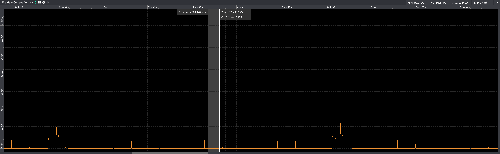
<br />

### Changing Sensor Configuration via Downlink
To change the duty cycle and sensor parameters via downlink the above downlink packet format must be used.

The function `process_received_downlink()` processes the received downlink via LoRa. The sensor can only receive a downlink in the RX window after a successful uplink.

For this use case the maximum packet size is 6 bytes and can be varied. The parameters to be changed should be a non-zero entries and the rest can be left as zeroes if no changes are needed. The following sections describe changing duty cycle and sensor configurations with some examples.

#### Changing dutycycle
Uplink frequency at the end node is determined by the TX_INTERVAL. This TX_INTERVAL is used as a variable in this library to add the functionality of varying duty cycle. Few examples of changing duty cycle by updating `TX_INTERVAL` are mentioned below:

| Downlink Packet format| Explanation|
|---|---|
| `00 3C`| duty cycle = 60 seconds and 2 bytes are used for the downlink|
| `3C` |duty cycle = 60 seconds and lowest payload size |
| `01 68`| duty cycle = 360 seconds and 2 bytes are used for the downlink|
|`00 3C 00 00 00 00` | Only duty cycle is changed and rest are unchanged. 6 bytes used for the downlink |


#### Changing sensor mode
The sensor mode can be changed by adding non-zero values to the sensor mode byte in the downlink packet. Any invalid modes entered are discarded. Examples:

| Downlink Packet format| Explanation|
|---|---|
| `00 00 01` | changing sensor mode to 1. Consumes 3 bytes: minimal mode change|
| `00 00 01 00 00 00` |changing sensor mode to 1 and the rest are unchanged. Consumes 6 bytes |
| `00 00 06 00 00 00` |Discarded and no change since 6 is an invalid mode. Consumes 6 bytes |
| `01`| Valid packet format but doesn't change sensor mode, instead duty cycle is changed to 1 sec|

#### Changing sampling rate
The sensor sampling rate can be changed by adding non-zero values to the corresponding bytes in the downlink packet. Examples:

| Downlink Packet format| Explanation|
|---|---|
| `00 00 00 00 FA` | changing sensor sampling rate to 250ms. Consumes 5 bytes: minimal sampling rate change|
| `00 00 00 04 E2 00` |changing sensor sampling rate to 1250ms and the rest are unchanged. Consumes 6 bytes |
| `04 E2`| Valid packet format but doesn't change sensor sampling rate, instead duty cycle is changed to 1250 sec|

#### Changing number of sensor readings per measurement
Similarly, the number of sensor readings per measurement can be changed by adding non-zero values to the corresponding bytes in the downlink packet. A maximum of 20 is allowed. Examples:

| Downlink Packet format| Explanation|
|---|---|
| `00 00 00 00 00 05` | 5 readings per measurement. Consumes 5 bytes: minimal sampling rate change|
| `00 00 00 00 00 22` | invalid, maximum of 20 readings are allowed and the configuration is unchanged.|

#### Changing multiple parameters via single downlink
Multiple sensor parameters can be changed via downlink and below are such examples:

| Downlink Packet format| Explanation|
|---|---|
| `00 78 02 00 00 05` | Change duty cycle to 120 seconds, sensor mode to 2 (Median) and 5 readings per measurement|
| `00 78 03 00 FA 12` | Change duty cycle to 120 seconds, sensor mode to 1(Mode), 250ms sampling rate and 18 readings per measurement|

**Note:** the above downlink payload formats must be implemented with caution, else there is a danger of sleeping the MCU for unwanted periods of time or indefinitely or even a possible crash!  

### The Things Network
#### The Things Network Payload Decoder
TTN Payload decoder format can be found in the `ttnPayloadDecoder.js` file
#### The Things Network Credentials
The TTN Credentials should be entered into the `ttncredentials.h` file from the TTN console.

### Ultrasonic sensor
Ultrasonic sensor measures the distance to an object by measuring the time difference between sending a signal and receiving an echo from the object. The Ultrasonic sensor used for this project is [Maxbotix's MB-7389](https://www.maxbotix.com/Ultrasonic_Sensors/MB7389.htm).

The MB-7389 Ultrasonic sensor has an internal averaging methods to avoid small obstacles, irregularities and reporting the distance to the largest acoustic return while ignoring smaller targets. However, some anomalies are observed due to corner reflections and metal surfaces. These anomalies can be avoided using statistical methods such as averaging or calculating median of multiple measurements.

#### Ultrasonic Sensor modes
These statistical methods are implemented as `sensorModes`. For example, `sensorMode = 2` uses a median of all the readings. The following are the available sensor modes:

|Sensor mode| Statistical method|
|---|---|
|  1 | Mean  |
|  2 | Median  |
|  3 | Mode  |

The function `read_sensor_using_modes(unsigned int sensorMode, unsigned int sensor_sampling_rate, unsigned int sensor_numberOfReadings)` reads the ultrasonic sensor using these sensor modes and stores into an `uint_16` array called `readings_arr` of size 20. This means the maximum number of readings that can be read for averaging are 20. Changing this array size can accommodate more readings for averaging.

`maxbotix.h` file contains the ultrasonic sensor pin definitions.

##### Number of Readings
The number of readings for these averaging methods can be changed via variable `sensor_numberOfReadings`.

##### Sensor Sampling Frequency
Single read from the sensor is as fast as 150 to 250 milliseconds and five of such measurements would be sensed over a period of 0.75 - 1.5 seconds. These measurements can be spread out over a larger interval by changing the variable `sensor_sampling_rate`, which enables to use averaging methods with varying rates. Each measurement corresponding to a sensor mode is followed by an interval of `sensor_sampling_rate` milliseconds.

#### SD Card logging and RTC
Every lora event, sensor states and measurements are locally logged onto the SD Card using the [SDFat](https://github.com/jbeynon/sdfatlib) library. The sensor sets the SD Card error flag high if the local logging is failed. A Real-time Clock is used to create timestamps for these local logs.

Below is the function `writeToSDCard(String StringtobeWritten)` that writes to SD Card (found in `featherwing.cpp` file) sets the `SD_ERROR` flag high when write failed. This might need a SD Card replacement or a hard-reset.

```cpp
void writeToSDCard(String StringtobeWritten) {
  //add time stamp to every sd card write
  String timestamp = get_timestamp();
  StringtobeWritten = timestamp + String(',') +StringtobeWritten ;
  char buffchar[StringtobeWritten.length() + 1];
  StringtobeWritten.toCharArray(buffchar, StringtobeWritten.length() + 1);
  digitalWrite(8, HIGH);
  if (!sd.begin(chipSelect, SPI_HALF_SPEED)) {
    // set the SD_ERROR flag high;
    SD_ERROR = 1;
    Serial.println("SD Initialization Failed.");
  }
  else
  {
    ofstream sdout(name, ios::out | ios::app);
    if (!sdout)
    {
      Serial.println("SD Card Open Failed.");
      SD_ERROR = 1;
    }
    else {
      sdout << buffchar << endl;
      // close the stream
      sdout.close();
      SD_ERROR = 0;
    }
  }
  digitalWrite(8, LOW);
}
```
**Note on using SD Card/FeatherWing with Feather m0 LoRa:** On the feather m0 LoRa board, the Chip Select pin 8 is shared with the Radio module and needs to be pulled LOW to function. So when not in use it can be pulled HIGH to use other SPI devices, in this case FeatherWing and when done must be pulled back to LOW for the Radio module to work since the CS pin (#8) does not have a pullup built in.


## Appendix

### Solar Influence on Ultrasonic Sensor

Effect of Temperature on Ultrasonic Sensor readinds: There is a notable drift of the ultrasonic sensor readings over time due to the change in temperature. Even though this particular sensor model has internal temperature compensation, there is still drift in the sensor readings. This can be observed from the fact that when there is direct sunlight during the day the readings are increased because the direct sunlight is raising the temperature of the sensor housing which is erroneously inflating the internal temperature of sensor reading. The internal temperature compensation algorithm is then over compensating for the inflated temperature and returning an increased distance measure.

The following is the ultrasonic sensor readings vs temperature over a period of 24 hours.

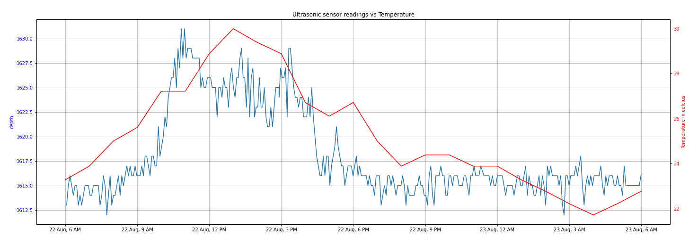
<br />

#### Steps to reduce Solar Influence on Ultrasonic Sensor readings
According to one of the [maxbotix's datasheet](https://www.maxbotix.com/documents/HRXL-MaxSonar-WRS_Datasheet.pdf), these below could help mitigate the noise.

  1. Using a Solar Shield for the ultrasonic sensor
  2. Creating more air-flow
  3. Using an external temperature compensation to the ultrasonic sensor

Additionally, using an reflective alluminum foil around the sensor cone has helped reduce the sensor noise.

The following are a few sensor designs that help mitigate this sensor noise:

  + This design consists of a larger housing which contains the original sensor setup inside, which acts as a solar shield and the bottom of this bigger housing is open for airflow and ultrasonic sensor ranging. Also additional external temperature compensation sensor has been added to the original design.

  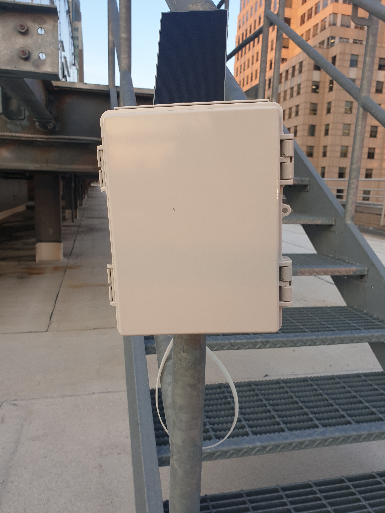
    <br />

  + In this design, a solar shield has been added to the original design.
  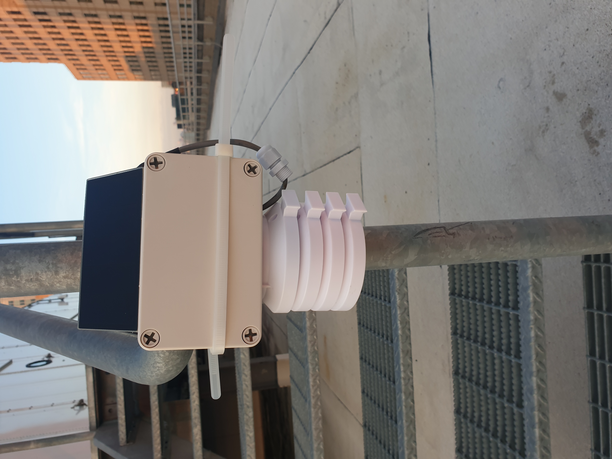
    <br />

  + In this design, the ultrasonic sensor has been housed completely inside the original housing.
  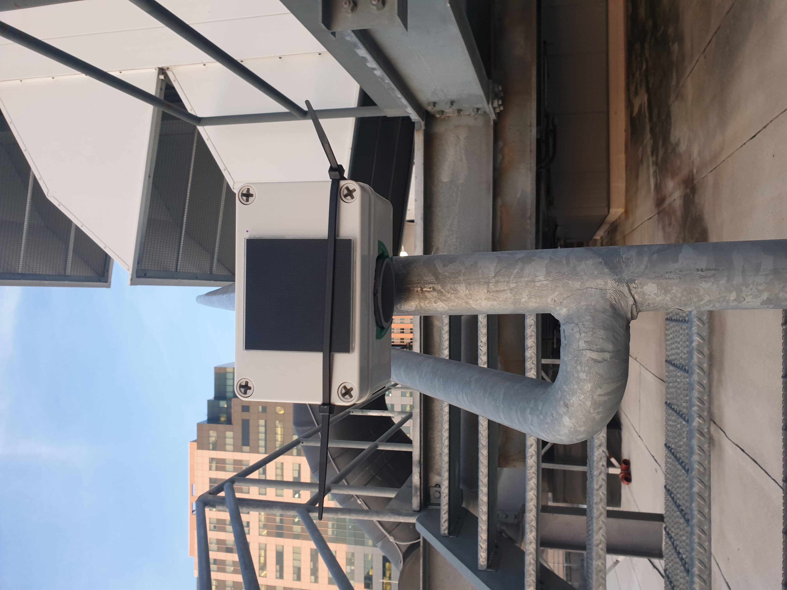
      <br />

The following are the comparisons to the original sensor data. All the graphs have been scaled to same ranges, and each block height representing 20mm or 2cm.

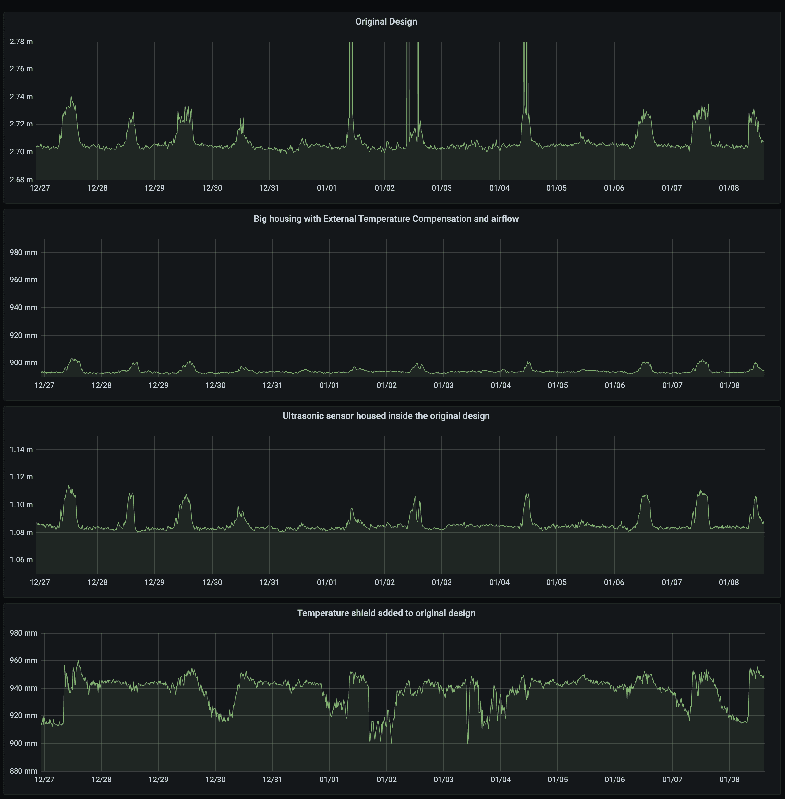
<br />


### Ultrasonic range sensor consistency

This following experiment provides the reasoning for using averaging methods (mean, median and mode, multiple readings and sensor sampling rates) for sensor stability in the source code.

The HRXL-MaxSonar-WR uses an internal filter to process range data. However, there are still particular reflections that can cause some anomalous readings in the data returned. We have tested the sensor in laboratory and experimental environments and the occurrence of false readings is likely to happen in 1/100 measurements (taken every five minutes). Therefore the following three data collection modes have been tested to understand and mitigate this with each measurement mode carried out every five minutes:
  + Mode 1: Single measurement
  + Mode 2: Three measurements taken consecutively, storing final one (to allow sensor to settle)
  + Mode 3: Median of five measurements taken consecutively

Figure below shows mode 1 and 2 exhibiting anomalous measurements throughout a longitudinal test period. See the peaks around July 31st around 02:30AM. These are removed when using the median approach of Mode 3. Another two modes were implemented that separated the radio operations from the sensing phases to further reduce the possible effects of power loading on accurate depth sensing. These provide more accurate measures of depth in low power situations.

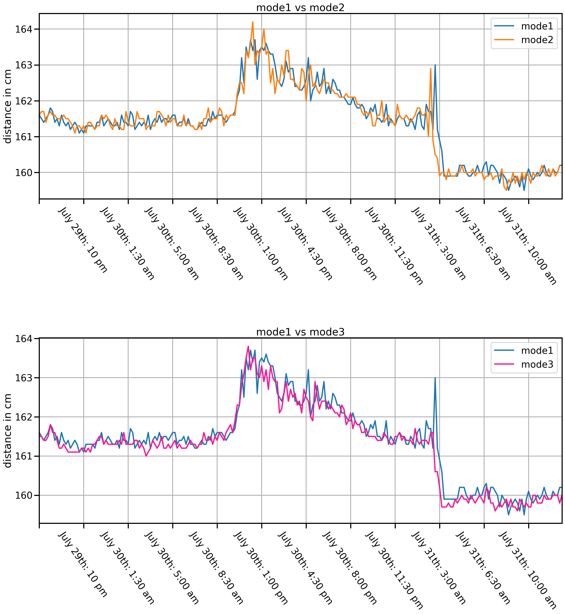
<br />

### Adafruit Sleepydog Library Deep-Sleep crash fix
On the latest 1.3.2 version of the Adafruit's Sleepy_dog library, a strange reset of feather m0 LoRa board is observed when sleeping for longer periods of time. This can be fixed by modifying the `WatchdogSAMD.cpp` file and the folowing are additions that start from the line 202 in original file (or from the line `#if (SAMD20 || SAMD21)` ):

```cpp
#if (SAMD20_SERIES || SAMD21_SERIES)
  // Don't fully power down flash when in sleep
  NVMCTRL->CTRLB.bit.SLEEPPRM = NVMCTRL_CTRLB_SLEEPPRM_DISABLED_Val;
#endif
#if defined(__SAMD51__)
  PM->SLEEPCFG.bit.SLEEPMODE = 0x4; // Standby sleep mode
  while (PM->SLEEPCFG.bit.SLEEPMODE != 0x4)
    ; // Wait for it to take
#else
  SCB->SCR |= SCB_SCR_SLEEPDEEP_Msk;
  // Due to a hardware bug on the SAMD21, the SysTick interrupts become 
  // active before the flash has powered up from sleep, causing a hard fault.
  // To prevent this the SysTick interrupts are disabled before entering sleep mode.
  SysTick->CTRL &= ~SysTick_CTRL_TICKINT_Msk;  // Disable SysTick interrupts
#endif

  __DSB(); // Data sync to ensure outgoing memory accesses complete
  __WFI(); // Wait for interrupt (places device in sleep mode)

#if (SAMD20_SERIES || SAMD21_SERIES)
  SysTick->CTRL |= SysTick_CTRL_TICKINT_Msk;   // Enable SysTick interrupts
#endif
  
  // Code resumes here on wake (WDT early warning interrupt).
  // Bug: the return value assumes the WDT has run its course;
  // incorrect if the device woke due to an external interrupt.
  // Without an external RTC there's no way to provide a correct
  // sleep period in the latter case...but at the very least,
  // might indicate said condition occurred by returning 0 instead
  // (assuming we can pin down which interrupt caused the wake).

  return actualPeriodMS;
}
```
### FloodSense Library Structure and Scope
This library has modules for each component, i.e. LoRa, Ultrasonic Sensor, FeatherWing etc. This enables to add future modules/functionalities without the need to modify the others. The sensor configuration is stored in the file `sensorcfg.h` which contains the variables that can be changed during run-time and are shared between all the modules.

Including the `floodsense_sensor.h` by using `#include <Floodsense_sensor.h>` setup ups the complete library. This header file has the reference to all the other header files and any further new header files must be linked to this file.
