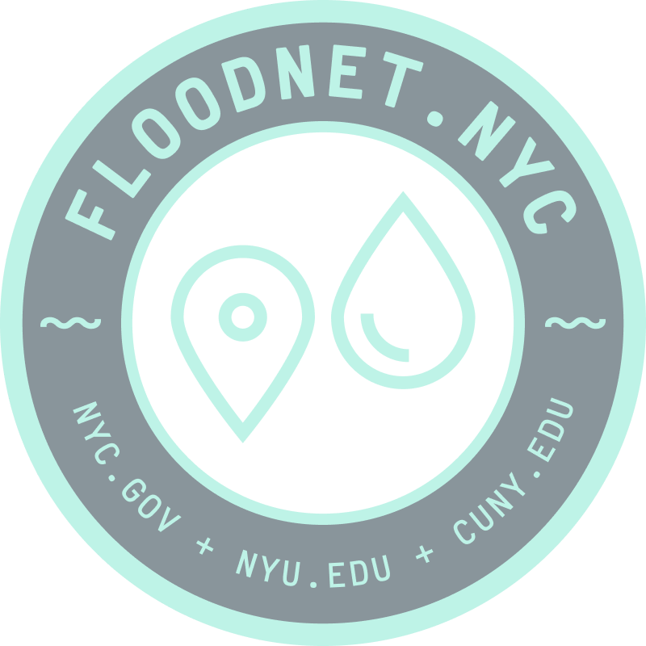

    

 

| [Suggest a sensor location](https://docs.google.com/forms/d/e/1FAIpQLScIM4Nu0z6l5HO8uzl9k4RGRSzU549LakNMNijnjGAHodFg9w/viewform) | [_@_ Contact us](mailto:info@floodnet.nyc) |
| :----------: | :----------: |

 

This repository houses information regarding the build, deployment, and maintenance of the FloodnNet project's flood sensor.
 

- [About FloodNet](#about-floodnet)
- [How to build a flood sensor](#how-to-build-a-flood-sensor)
  - [BOM](#bom)
  - [Sensor build instructions with Quality Assurance Procedures](#sensor-build-instructions-with-quality-assurance-procedures)
  - [Installing sensor software](#installing-sensor-software)
  - [Quality Control Testing](#quality-control-testing)
    - [In-lab sensor measurements validation](#in-lab-sensor-measurements-validation)
  - [Troubleshooting](#troubleshooting)
- [How to deploy a flood sensor](#how-to-deploy-a-flood-sensor)
  - [Deployment location identification strategy](#deployment-location-identification-strategy)
  - [Criteria for a good mounting options](#criteria-for-a-good-mounting-options)
  - [Flood sensor deployment steps](#flood-sensor-deployment-steps)
- [How to maintain a flood sensor](#how-to-maintain-a-flood-sensor)
  - [Firmware updates](#firmware-updates)
  - [Common problems](#common-problems)
  - [Maintenance visits](#maintenance-visits)
- [Additional resources](#additional-resources)
 

# About FloodNet
FloodNet is a partnership between academic researchers at New York University and the City University of New York, and NYC municipal agencies (NYC Mayor’s Office of Climate & Environmental Justice and Mayor’s Office of the Chief Technology Officer), working in consultation with community organizations.

# How to build a flood sensor
This section contains the resources to build a flood sensor from the raw materials to final product. 

Please note that these instructions are relevant only to the end-device sensing component within a larger sensor network infrastructure. For an overview of the complete network infrastructure refer to the FloodNet network infrastructure on the [documentation website](https://floodnet-nyc.github.io//real-time-data-pipeline/#31-data-flow-pipeline-overview). The [Gateway](https://github.com/floodnet-nyc/floodnet-gateway) and [NodeRED](https://github.com/floodnet-nyc/floodnet-nodered) repositiories are linked in the additional resources section for reference. 

### BOM 
The total sensor cost per unit is below $200. When mounting hardware is included the total cost of the sensor plus mounting hardware comes around $210. A list of complete bill of materials for the sensor and mounting hardware is available in the [BOM](https://github.com/floodnet-nyc/flood-sensor/tree/main/hardware/BOM.md) document.

### Sensor build instructions with Quality Assurance Procedures
The step by step sensor build instructions including images, quality assurance steps, and quality control checks are detailed in the FloodNet's [QA/QC documentation](https://floodnet-nyc.github.io//quality-management/sensor-assembly-qap/) website.

### Installing sensor software
After the sensor assembly stage is the installation of the sensor firmware. To install the sensor's firmware follow the steps detailed in the of the firmware folder's [README.md](https://github.com/floodnet-nyc/flood-sensor/tree/main/firmware/readme.md). 

### Quality Control Testing 

#### In-lab sensor measurements validation

### Troubleshooting

# How to deploy a flood sensor

### Deployment location identification strategy

### Criteria for a good mounting options

### Flood sensor deployment steps

# How to maintain a flood sensor

### Firmware updates

### Common problems

### Maintenance visits

# Additional resources

------------------------------------------------------------------------------------------------------------------------
Shield: [![CC BY-NC-SA 4.0][cc-by-nc-sa-shield]][cc-by-nc-sa]

This work is licensed under a
[Creative Commons Attribution-NonCommercial-ShareAlike 4.0 International License][cc-by-nc-sa].

[![CC BY-NC-SA 4.0][cc-by-nc-sa-image]][cc-by-nc-sa]

[cc-by-nc-sa]: http://creativecommons.org/licenses/by-nc-sa/4.0/
[cc-by-nc-sa-image]: https://licensebuttons.net/l/by-nc-sa/4.0/88x31.png
[cc-by-nc-sa-shield]: https://img.shields.io/badge/License-CC%20BY--NC--SA%204.0-lightgrey.svg
