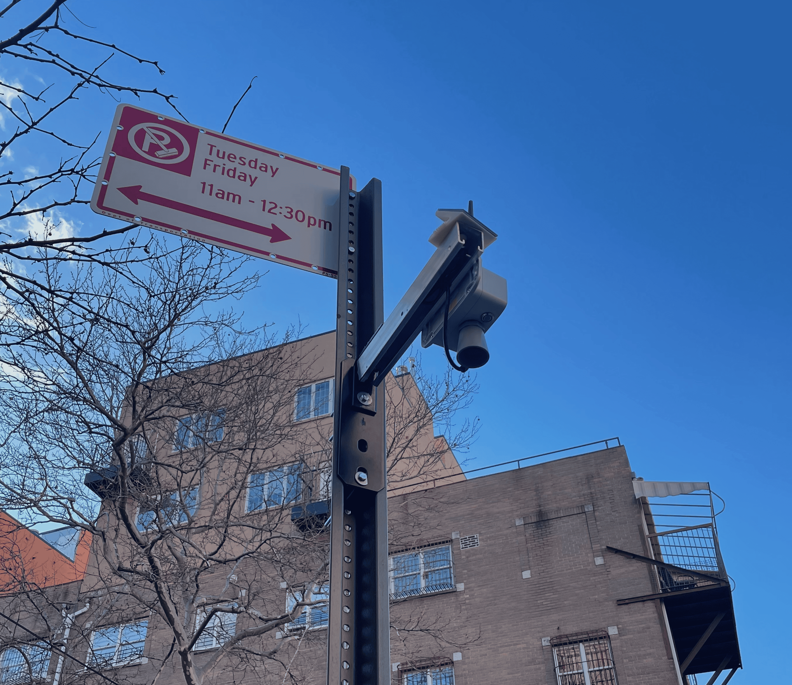
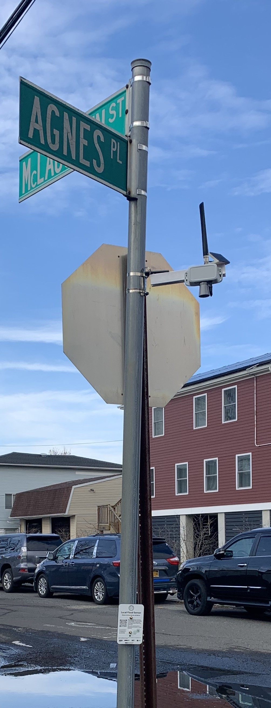
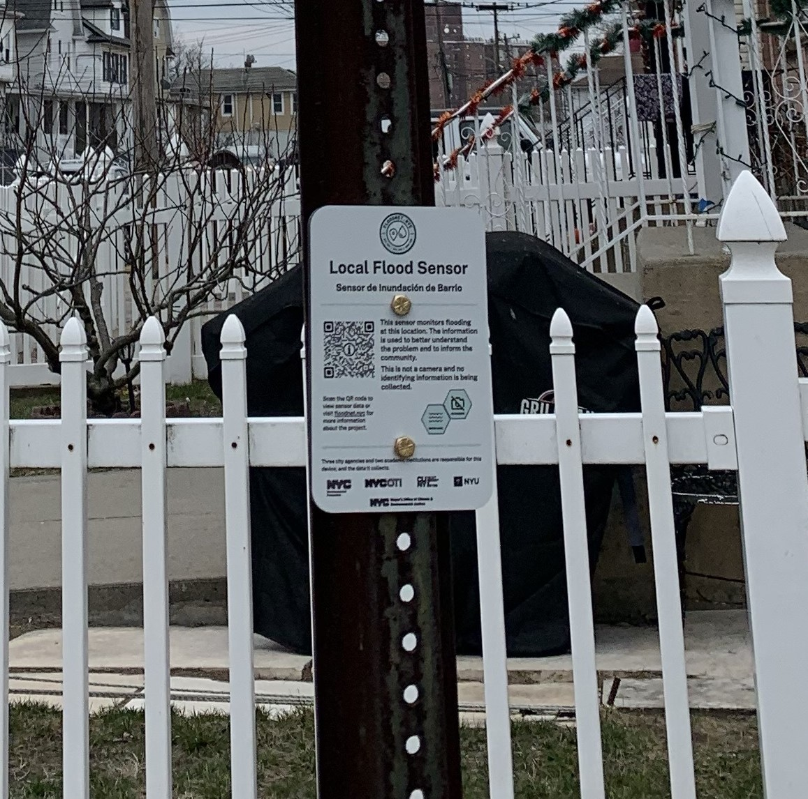

# Flood Sensor Deployment Manual
Once the sensor deployment location is identified, this manual explains the next steps to deploy a [FloodNet](https://www.floodnet.nyc) flood sensor. This is the second stage in deploying a flood sensor, and the first is detailed in the [Flood Hotspots Identification](https://github.com/floodnet-nyc/flood-sensor/blob/main/deployment/hotspot%20identification/flood-hotspots-identification.md) document.

**Table of Contents:**
- [Flood Sensor Deployment Manual](#flood-sensor-deployment-manual)
  - [1. Things to do - Before leaving the lab](#1-things-to-do---before-leaving-the-lab)
    - [1.1. Checklist](#11-checklist)
    - [1.2. Notes on Sensor mount preparation](#12-notes-on-sensor-mount-preparation)
    - [1.3. Registering sensor on TTN Application](#13-registering-sensor-on-ttn-application)
    - [1.4. Acquiring FloodNet approval](#14-acquiring-floodnet-approval)
    - [1.5. Acquiring Approval for Mounting Location](#15-acquiring-approval-for-mounting-location)
  - [2. Confirming Mounting Location on the Ground](#2-confirming-mounting-location-on-the-ground)
  - [3. Sensor Installation Process](#3-sensor-installation-process)
    - [3.1. Accessing the infrastructure](#31-accessing-the-infrastructure)
    - [3.2. Mount installation](#32-mount-installation)
    - [3.3. Solar Panel installation](#33-solar-panel-installation)
    - [3.4. Levelling](#34-levelling)
  - [4. Joining the FloodNet network](#4-joining-the-floodnet-network)
  - [5. Start Sensing](#5-start-sensing)
  - [6. Signage](#6-signage)
  - [7. Photo](#7-photo)
  - [8. Next Steps](#8-next-steps)
    - [8.1 Sensor Locations Logged in Database](#81-sensor-locations-logged-in-database)

## 1. Things to do - Before leaving the lab
This section details how we prepare for sensor deployment. Steps include compiling tools, preparing mounting equipment, and adding the sensor to the TTN app. 
### 1.1. Checklist
This section contains the checklist for necessary tools, hardware, and equipment needed for the sensor deployment process.
| No | Item                                       | Count/sensor |
|----|--------------------------------------------|-------|
| 1  | [High leverage combination pliers](https://www.knipex.com/products/combination-and-multifunctional-pliers/high-leverage-combination-pliers/high-leverage-combination-pliers/0205200)           | 1     |
| 2  | [Adjustable wrench](https://www.kleintools.com/catalog/adjustable-wrenches/adjustable-wrench-standard-capacity-18-inch)                          | 1     |
| 3  | [Phillips #2 screwdriver](https://www.kleintools.com/catalog/screwdrivers/2-phillips-screwdriver-4-round-shank)                    | 1     |
|  4  | [Oversized Clipped Washers](https://www.mcmaster.com/93409A136/)                                           |    4   |
|  5  | [Green Powder-Coated Steel Strut Channel with Mounting Plate]()                                           |    1   |
|  6  | [Stainless Steel Hex Head Screw - 7/16"-14 thread size](https://www.mcmaster.com/92800A393/)                                           |    4   |
|  7  |  [Locknuts - 7/16"-14 thread size](https://www.mcmaster.com/90630A112/)                                        |    4   |
|  8  | Ratchet Wrench - 7/16", 1/2", 9/16" and 13mm                                                                        |1|
|  9  | Wire cutter                                                                                   |1|
| 10  | Plier                                                                                          |1|
| 11  | Zipties                                                                                           |5|
| 12  | Sockets - 12mm, 13mm and 14mm                                                                       |1 |
| 13  | Power Drill                                                                                     |  1|
| 14  | Steel Straps and strapping tool                                                                                          |1|
| 15  | Circuler Bubble Level                                                                                           |  1 |
| 16  | 3" Hex head M8 bolts and 3" Hex head M6 bolts                                                                 | 2+2 |
| 17  | M8 Lock nut and Lock washer                                                                                   | 4 |
| 18  | M6 Lock nut and Lock washer                                                                                   | 4 |
| 19  | 1.5" Hex head M8 bolts and 1.5" Hex head M6 bolts                                                                 | 2+2 |
| 20  | Foldable Ladder                                                                                                 |1|    
| 21  | 3" mending plate                                                                                                |1|
### 1.2. Notes on Sensor mount preparation
After we have identified the ideal mounting infrastructure (see [Flood Hotspots Identification](https://github.com/floodnet-nyc/flood-sensor/blob/main/deployment/hotspot%20identification/flood-hotspots-identification.md) document), the next step is to identify the mounting position on the post/pole itself. 

Below are a few examples of different DOT signpost designs found across NYC, explaining optimal sensor placement scenarios.

*<insert_image_signpost_with_parking_sign>*

*<insert_image_signpost_with_stop_sign>*

*<insert_images_other_types>*

### 1.3. Registering sensor on TTN Application
Register the sensor on TTN by following these [steps.](https://github.com/floodnet-nyc/flood-sensor/tree/main/firmware)
### 1.4. Acquiring FloodNet approval
Sensor locations confirmed in weekly meeting prior to deployment

### 1.5. Acquiring Approval for Mounting Location
We have blanket approval from DOT to mount sensors on drive rails, also known as U-Channel posts. Each month, we update them on where new sensors have been installed. We have to obtain special approval to mount on other types of DOT infrastructure.

To mount on a utility pole, we have to obtain approval from the company that owns that pole. This process varies depending on the company.

## 2. Confirming Mounting Location on the Ground
Though we try to identify optimal sensor placement [before leaving the lab](https://github.com/floodnet-nyc/flood-sensor/blob/main/deployment/hotspot%20identification/flood-hotspots-identification.md), unexpected obstacles can arise once we arrive at the mounting site.
All the potential locations according to there priority is scouted and saved in the [FN Field Map](https://www.google.com/maps/d/u/1/edit?mid=1piTISi5Sm9NA6EmDnJhYw2CSyvhEOpE&ll=40.70724807589592%2C-73.93295012773706&z=17)
Potential obstacles include:
- Drive rail is slanted, or is not well secured. 
- Mounting location is overly shaded by a large building or aboveground train track or trees.
- Mounting location is in the path of a truck or bus, and sensor mounting arm would have to point into the street.
- Mounting location is on grass.

Sometimes, a new mounting location will have to be selected in the field. Helpful clues for selecting a flood-prone location include:
- Drive rail is close to a storm drain
- Street near drive rail is muddy and/or marked by the accumulation of trash
- Drive rail is located on the north side of the street, or has good sunlight exposure
- Drive rail is tall enough for sensor to be out of reach

## 3. Sensor Installation Process
To ensure the optimal sensor placement, we need to complete the following steps:

### 3.1. Accessing the infrastructure
- Finalize the location for sensor placement: Carefully select the ideal spots to position the sensors throughout the area.
- Securely position the ladder: Place the ladder on the ground firmly and securely to ensure stability while accessing higher areas for sensor installation.
- Determine the sensor height: Assess the appropriate height at which the sensors should be placed. Generally, a range of 2-3 meters is suitable for optimal data collection and accuracy.
- Mind the street signs: Take into consideration the street signs in the vicinity. Avoid obstructing them during sensor placement. If necessary, temporarily remove the signs to achieve the perfect sensor positioning, ensuring they are securely reinstated once the sensors are installed. *<insert_image>* 

### 3.2. Mount installation 
To ensure proper installation of the sensor mount, follow the appropriate method based on the specific conditions and types of U-posts, drive rails, and sign posts. There are three types of installation methods outlined below:

- Mounting the sensor on the front side of the post:
 To mount the sensor on the front side of the post, follow these steps for a secure installation:
  - Position the L plate on the post: Take the L plate that is attached to the mount and carefully place it on the front side of the post, ensuring it is positioned at the desired height.
  - Secure the sensor mount: Using two M8 1.5" bolts, along with two M8 locknuts and four Oversized Clipped Washers, fasten the sensor mount firmly onto the U-post. Make sure the bolts are tightened securely to ensure stability.
By properly positioning the L plate on the front side of the post and using the specified bolts, locknuts, and Oversized Clipped Washers to secure the sensor mount, you can achieve a robust and reliable installation for the sensor on the U-post. (Refer to the provided image for visual reference.)
  

 

- Mounting the sensor on the back side of the post:
  To mount the sensor on the back side of the post, follow these steps for a secure installation:
   - Position the L plate with a mending plate: Take the L plate attached to the mount and place it on the back side of the post. Ensure that a mending plate is inserted between the L plate and the post. This additional plate provides reinforcement and stability.
   -  Secure the sensor mount: Use two M8 3" bolts, along with two M8 locknuts and four Oversized Clipped Washers, to firmly attach the sensor mount to the U-post. Fasten the bolts tightly to ensure a secure and stable mounting.
By positioning the L plate with the mending plate on the back side of the post and using the specified M8 bolts, locknuts, and Oversized Clipped Washers, you can achieve a reliable and sturdy installation for the sensor on the U-post. (Refer to the provided image for visual reference.)
  

 

- Mounting the sensor on the post with an obstacle such as a stop sign, parking sign, or do not enter sign:

  To mount the sensor on a post with an obstacle like a stop sign, parking sign, or do not enter sign, follow these steps for a successful installation:
  
  - Prepare the area: Begin by unbolting the sign from the bottom, allowing it to be rotated or temporarily moved to create sufficient space for installing the mount.
  - Install the sensor mount: Once the obstacle has been moved or rotated, proceed with the steps mentioned earlier to securely mount the sensor on the U-post. This involves using the appropriate mounting hardware and following the provided instructions.
By carefully unbolting and repositioning the sign to create the necessary clearance, you can then proceed with the regular steps for mounting the sensor on the U-post. (Refer to the provided image for visual reference.)
*<Insert the image with the obstruction>*
  
- Mounting on a direction or signage round pole:
To ensure secure placement of the sensor, we will employ steel straps and a strapping tool. Follow these steps for a successful installation:
  - Determine the strap length: Estimate the required length of the straps, ensuring they are long enough to securely fasten the sensor. Cut two pieces from the steel strap roll, matching the estimated length.
  - Position the L plate on the round pole: Attach the L plate to the mount and place it on the round pole at the desired location for sensor installation.
  - Begin strapping the first strap: Using the strapping tool, start securing the first strap around the round pole and the L plate. Apply tension to the strap using the tool and ensure it is tightly fastened.
  - Repeat the process for the second strap: Once the first strap is securely tightened, repeat the same procedure for the second strap. Apply tension to the strap using the strapping tool, ensuring a firm and stable attachment.
By utilizing the steel straps and strapping tool, cutting the appropriate length of straps, and securely fastening the sensor to the round pole using the L plate, you can achieve a reliable and secure placement of the sensor.(Refer to the provided image for visual reference.)
  

 

By carefully following these guidelines, you can ensure the proper and secure installation of the sensor mount, tailored to the specific conditions and post types involved.
### 3.3. Solar Panel installation
To maximize solar power harvesting, the solar panel should be south-facing and exposed to direct sunlight. This factors into location selection, as discussed in the [Flood Hotspots Identification](https://github.com/floodnet-nyc/flood-sensor/blob/main/deployment/hotspot%20identification/flood-hotspots-identification.md) document, but we also have to adjust the panel orientation as we are installing the sensor itself.
It is essential to ensure that the wing nut is securely tightened after making any adjustments.

### 3.4. Levelling
Though we try to avoid mounting on overly slanted drive rails, a bit of slant is almost unavoidable. Once the sensor is partially secured to the drive rail, we use a level to determine how the pitch of the drive rail is impacting the angle of the mounting infrastructure. We use washers, zip ties, or other spacers to adjust the angle at which the sensor is mounted to the drive rail.

*<insert_image_sensor_angle_adjusted_with_spacers>*
Furthermore, achieving parallel alignment of the sensor with the ground is crucial. To accomplish this, follow these steps:
- Place the circular bubble level at the bottom of the cone and observe the reading.
- Next, position the level on the ground directly beneath the sensor and take a reading. The bubble in the level should be in the opposite direction, indicating that the sensor is parallel to the ground. If not then adjust the mount little bit. *<insert the image*>

## 4. Joining the FloodNet network
Once the installation is complete, it is important to perform a final check to ensure the proper functioning of the sensor. Follow these steps:
- Verify the antenna tightness: Double-check that the antenna is securely tightened in place. This will help optimize the signal reception and transmission.
- Switch on the sensor: Power on the sensor, and you should observe a green light illuminating. This indicates that the sensor is receiving power and is operational.
- Establish connection to the gateway: Wait for a moment as the sensor establishes a connection with the gateway. The green light will turn off once the sensor successfully connects.
 
## 5. Start Sensing
Access data on The Things Network: With the sensor connected, the collected data will become visible on The Things Network platform. You can now monitor and analyze the data transmitted by the sensor.

## 6. Signage
When mounting signage on a drive rail, please follow these steps:
- Determine the appropriate height: Position the sign at a suitable height that allows accessibility for individuals sitting in a wheelchair. This ensures inclusivity and ease of access.
- Secure the sign to the drive rail: Utilize two 1.5" M6 bolts, along with two M8 lock washers and two M6 lock nuts, to firmly fasten the sign onto the drive rail. This ensures a secure attachment.
 

 

When mounting signage on a round pole:

## 7. Photo
Photos of sensor installed on location (for records and use in FieldKit dashboard). Photo should include surrounding area (from approx. 10 feet away).

## 8. Next Steps
After a successful installation, follow the below steps to complete the sensor deployment process:
### 8.1 Sensor Locations Logged in Database
New sensor locations should be recorded into master spreadsheet as well as deployment map
