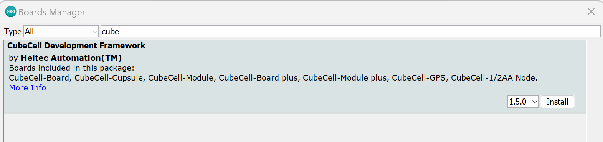
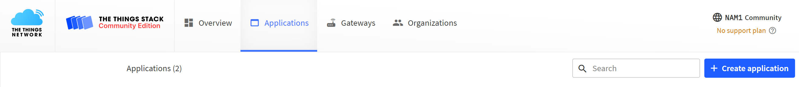
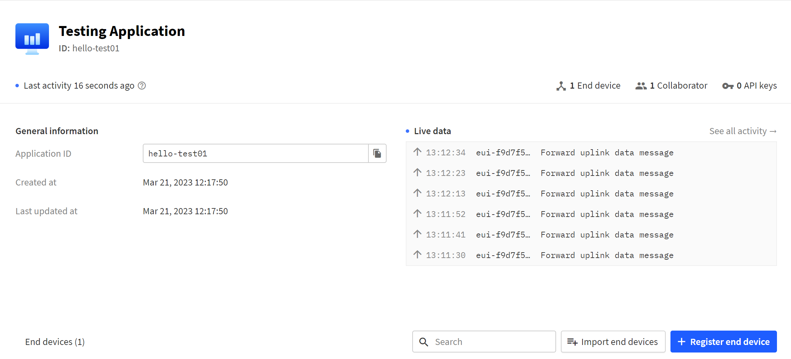
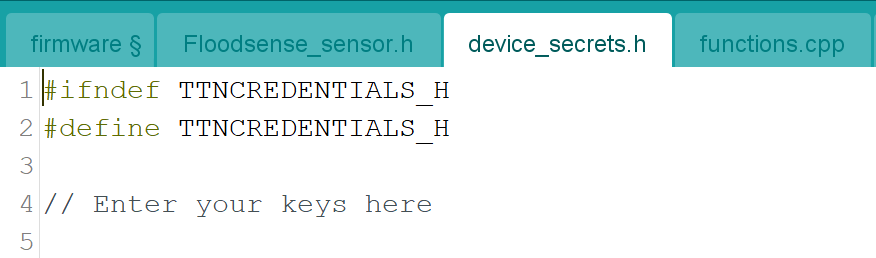
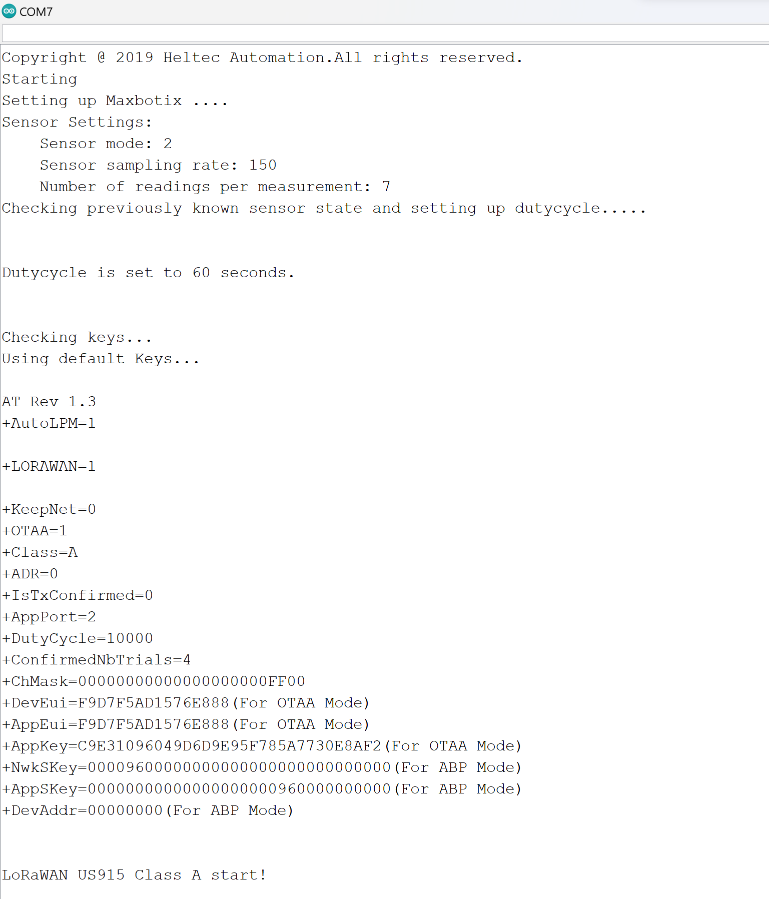

# Firmware technical documentation

- [Firmware technical documentation](#firmware-technical-documentation)
  - [Installation and setup](#installation-and-setup)
    - [Arduino IDE](#arduino-ide)
    - [Installing CubeCell Library](#installing-cubecell-library)
    - [Registering the device to The Things Network](#registering-the-device-to-the-things-network)
    - [Creating an end-device](#creating-an-end-device)
   
  - [Usage](#usage)
    - [Installing the device secrets](#installing-the-device-secrets)
    - [Compiling and Uploading the firmware to the sensor](#compiling-and-uploading-the-firmware-to-the-sensor)
    - [Uplink packet format](#uplink-packet-format)
    - [Downlink packet format](#downlink-packet-format)
    - [Modifying Sensor Configuration using Downlinks](#modifying-sensor-configuration-using-downlinks)
      - [Changing dutycycle](#changing-dutycycle)
      - [Changing sensor mode](#changing-sensor-mode)
      - [Changing sampling rate](#changing-sampling-rate)
      - [Changing number of sensor readings per measurement](#changing-number-of-sensor-readings-per-measurement)
      - [Changing multiple parameters via single downlink](#changing-multiple-parameters-via-single-downlink)
      - [Changing sensor state](#changing-sensor-state)


## Installation and setup

### Arduino IDE
For simplicity, Arduino IDE has been used in the documentation but other IDEs can also be used. Arduino IDE, can be downloaded from [Arduino's website](https://www.arduino.cc/en/software). The Arduino IDE is used for uploading the firmware to the microcontroller.

Add HelTec Boards to the IDE, there are two ways:
 - Using Arduino's Boards Manager.
     - Open Arduino IDE, and goto `File->Preferences->Settings`
      <br> 
       
     
     - Enter this url `https://github.com/HelTecAutomation/CubeCell-Arduino/releases/download/V1.5.0/package_CubeCell_index.json` to board manager URLs. Then hit 		 ok.
     - After that goto `Tools->Board->Boards Manager`, and search CubeCell. In the new pop-up dialog, select the latest releases and click install. 
      <br>
      
 - Using Github.
     - Follow the instructions mentioned [here.](https://github.com/HelTecAutomation/CubeCell-Arduino/blob/master/InstallGuide/windows.md)
     </a>

### Installing CubeCell Library
This repo is built to run on CubeCell's example library. To install the CubeCell's library, follow the instructions on their repo [here](https://github.com/HelTecAutomation/CubeCell-Arduino/tree/master/InstallGuide)

### Registering the device to The Things Network
 Setting up The Things Network
  - Make an account on The Things Network at [here](https://www.thethingsnetwork.org/)
  - Now Login [here](https://nam1.cloud.thethings.network/console/) with your The Things ID credentials.
  - If the target application at which your device will be registered is not created yet, follow this step.
      - Goto Application-> Create application.
        <br>
        
      - Enter Application ID(should be unique) and Application Name.
 
      
### Creating an end-device
 Registering End Device.
   - Goto the application then click on ‘Register end device’.
     <br> 
       
   - Select the end device in the LoRaWAN Device Repository. Refer the following image.
     <br> 
      
   - For the `JoinEUI` field, an random ID can be used except all zeros (for example, `FA CD 67 98 HY 7J 54 00` can be used but not `00 00 00 00 00 00 00 00`). Next, the fields `DevEUI` and `AppKey`needs to be entered, which can be generated by clicking on generate. And then click on Register end Device. 

## Usage
 To use this library, user can simply open firmware.ino from the [firmware folder](https://github.com/floodnet-nyc/flood-sensor/tree/main/firmware).
### Installing the device secrets
 - Connecting CubeCell to the Arduino IDE.
    - Open Arduino IDE and goto `Tools>Board>CubeCell>HTTC(AB02)`. And set the configurations according to the image below.
      <br> 
       
    - Connect the HelTec CubeCell board to the computer via a high quality Micro USB cable. CP2102 driver is required, most of the time it will install
      automatically and if didn't install automatically, please refer to this [document.](https://docs.heltec.cn/general/establish_serial_connection.html).
    - Select the port at which CubeCell is connected to computer by going to `Tools>Port`.
 - EEPROM should be cleared every time when changes are made to device secrets. Clear the EEPROM which you have to upload the following example.
      Goto `File->Examples->EEPROM->eeprom_clear` and upload the code by clicking on the right arrow symbol.
 - Adding device secerts in the firmware.
    - Open `firmware.ino`. This will open all the files reuired by the sensor to be working.
    - Open device_secrets.h file from the tab.
      <br> 
       
    - Enter the `DevEUI`,`JoinEUI` and `AppKey` in `TTN_DEVEUI`, `TTN_APPEUI` AND `TTN_APPKEY` respectively like shown in the image below. 
      <br> 
       
    - Save the file but it's in read only mode so save it in another location. Goto File and click Save. A prompt will open then hit OK and then Save it to another    
      location. NOTE: Save the file each time you make changes in the sensor IDs.

### Compiling and Uploading the firmware to the sensor
  - After installing the device secerts. Goto firmware tab and compile the code by clicking on the tick symbol. Then upload it.
  - Verify if CubeCell is working correctly, by opening the Serial Monitor in Arduino IDE. Make sure CubeCell is still connected to the computer.
    - On clicking on the magnifying icon the serial monitor will open.
    - Set the Baud to 115200.
    </a>
    After setting the baud data will start showing on the serial monitor. Verify your `DevEUI`, `AppEUI` and `AppKey` in the window.
    <br>
    <br> 
     

### Uplink packet format

Measurement is the regular uplink packet format when the sensor is operational and in the sensing mode. In stop mode, the sensor sends its current configuration as the uplink payload information. 

**Measurement:**

| Error flags  | Battery Level | Ultrasonic reading  |
|--------------|---------------|---------------------|
|   1 byte     |    2 bytes    |        2 bytes      |

**Cfg packet format:**

| Error flags  | Sensor Mode | Sensor Sampling Rate | Sensor Number of Readings |
|--------------|---------------|---------------------|---------------------|
|   1 byte : 255 or 0xFF     |    1 byte   |      2 bytes         |        1 bytes            |

**Error Flags:**

|     bit 7    |     bit 6   |     bit 5    |     bit 4    |     bit 3    |     bit 2    |     bit 1    |     bit 0    |
|   ----       |   ----      |     ----     |     ---      |      ---     |      ---     |       ---    |      ---     |
|      Used only for CFG update (all other bits are high)         |             |              |              |              |              |              | SD error flag|

^empty flags above - bits 1-6 are for future use.

### Downlink packet format

```<header> <command>```

| Header | Command            | Functionality                                                |
| ------ | ------------------ | ------------------------------------------------------------ |
| `0x4D` | Sensor Mode Change | Changes sensor aggregate, duty cycle, measuring delta, number of readings for averaging. |
| `0x41` | Application Change | Changes LoRaWAN Application                                  |
| `0x4F` | Sensor State       | `Start/Stop/Reset`. On a Reset the default sensor state is `Stop`, and it sends CFG packets as uplink. Starts sensing when changed to `Start` state. `Reset` resets the sensor using a watchdog timer. |

### Modifying Sensor Configuration using Downlinks

Following are types of downlinks available categorized based on their functionality.

#### Changing dutycycle

Uplink frequency at the end node is determined by the TX_INTERVAL. This TX_INTERVAL is used as a variable in this library to add the functionality of varying duty cycle. Few examples of changing duty cycle by updating `TX_INTERVAL` are mentioned below:

| Command| Explanation|
|---|---|
| `00 3C`| duty cycle = 60 seconds and 2 bytes are used for the downlink|
| `3C` |duty cycle = 60 seconds and lowest payload size |
| `01 68`| duty cycle = 360 seconds and 2 bytes are used for the downlink|
|`00 3C 00 00 00 00` | Only duty cycle is changed and rest are unchanged. 6 bytes used for the downlink |


#### Changing sensor mode
The sensor mode can be changed by adding non-zero values to the sensor mode byte in the downlink packet. Any invalid modes entered are discarded. Examples:

| Command | Explanation|
|---|---|
| `00 00 01` | changing sensor mode to 1. Consumes 3 bytes: minimal mode change|
| `00 00 01 00 00 00` |changing sensor mode to 1 and the rest are unchanged. Consumes 6 bytes |
| `00 00 06 00 00 00` |Discarded and no change since 6 is an invalid mode. Consumes 6 bytes |
| `01`| Valid packet format but doesn't change sensor mode, instead duty cycle is changed to 1 sec|

#### Changing sampling rate
The sensor sampling rate can be changed by adding non-zero values to the corresponding bytes in the downlink packet. Examples:

| Command | Explanation|
|---|---|
| `00 00 00 00 FA` | changing sensor sampling rate to 250ms. Consumes 5 bytes: minimal sampling rate change|
| `00 00 00 04 E2 00` |changing sensor sampling rate to 1250ms and the rest are unchanged. Consumes 6 bytes |
| `04 E2`| Valid packet format but doesn't change sensor sampling rate, instead duty cycle is changed to 1250 sec|

#### Changing number of sensor readings per measurement
Similarly, the number of sensor readings per measurement can be changed by adding non-zero values to the corresponding bytes in the downlink packet. A maximum of 20 is allowed. Examples:

| Command | Explanation|
|---|---|
| `00 00 00 00 00 05` | 5 readings per measurement. Consumes 5 bytes: minimal sampling rate change|
| `00 00 00 00 00 22` | invalid, maximum of 20 readings are allowed and the configuration is unchanged.|

#### Changing multiple parameters via single downlink
Multiple sensor parameters can be changed via downlink and below are such examples:

| Command | Explanation|
|---|---|
| `00 78 02 00 00 05` | Change duty cycle to 120 seconds, sensor mode to 2 (Median) and 5 readings per measurement|
| `00 78 03 00 FA 12` | Change duty cycle to 120 seconds, sensor mode to 1(Mode), 250ms sampling rate and 18 readings per measurement|

**Note:** the above downlink payload formats must be implemented with caution, else there is a danger of sleeping the MCU for unwanted periods of time or indefinitely or even a possible crash!  

#### Changing sensor state

| Operation | Command             |
| --------- | ------------------- |
| Start     | `73 74 61 72 74`    |
| Stop      | `73 74 6f 70`       |
| Reset     | `72 65 73 65 74`    |

## TTN Decoder 
```
// decoder variable contains Error Flags followed by Battery and sensor data.
function Decoder(b, port) {
  var decoded = {};

  // Error Flags
  /*
  Format:
    |--------------------------------------------- Error Flags  -----------------------------------------------------------------------------------------------------------|
    |     bit 7                                                    |     bit 6   |     bit 5    |     bit 4    |     bit 3    |     bit 2    |     bit 1    |     bit 0    |
    |     Used only for CFG update (all other bits are high)       |             |              |              |              |              |              | SD error flag|
  255 or FF is a CFG update
  */
  var errorFlag = b[0];

  if (errorFlag == 255) {
    // Payload is Sensor cfg update
    /*
      CFG update uplink Format:
      | Error Flag  |   sensor_sleep   |    sensor_agg     |   sensor_meas_delta     | sensor_reading_count   |    sensor_state   |    fw_ver       |
      |    255 (FF) |     2 bytes      |      1 byte       |          2 bytes        |          1 byte        |        1 byte     |    6 bytes      |
                 
      Sensor State:
      |  Start  |   Stop  |  Reset  |
      |   's'   |   'x'   |   'r'   |

    */

    // Duty cycle
    var sensor_sleep = (b[2]<< 8) | b[1];
    decoded.sensor_sleep = sensor_sleep;

    // Sensor Mode
    var sensor_agg = b[3];
    decoded.sensor_agg = sensor_agg;

    // Sensor Sampling Rate
    var sensor_meas_delta = (b[5] << 8) | b[4];
    decoded.sensor_meas_delta = sensor_meas_delta;

    // Sensor number of readings per measurement
    var sensor_reading_count = b[6];
    decoded.sensor_reading_count = sensor_reading_count;

    // Sensor State
    var sensor_state = b[7].toString();
    if (sensor_state == "115"){
      sensor_state = "Sensing";
    } else if (sensor_state == "120"){
      sensor_state = "CFG Update";
    } else if (sensor_state == "114"){
      sensor_state = "Reset";
    }
    decoded.sensor_state = sensor_state;

    // Firmware Version
    let major = b[8].toString();
    let minor = b[9].toString();
    let patch = b[10].toString();
    let v = "v";
    let dot = ".";
    let fw_ver = v.concat(major,dot,minor,dot,patch);
    decoded.fw_ver = fw_ver;

    
  } else {
    
    // Regular Payload
      var sdError, battery, distance;
      // Converting Error Flag bits
      sdError = errorFlag % 2;
      decoded.sdError = sdError;
  
      // battery
      battery = (b[2] << 8) | b[1]; // battery in centi Volts
      battery = battery / 1000; // Convert to Volts
      decoded.battery = battery;
  
      // distance
      distance = (b[4] << 8) | b[3];
      decoded.distance = distance;
      
      // // Regular Payload
      // var acc_mm, event_acc_mm, total_acc_mm, r_int_hr_mm, tips;
      
      // decoded.acc_mm = (b[0]|(b[1]<<8)|(b[2]<<16)|(b[3]<<32))/100;
      // decoded.event_acc_mm = (b[4]|(b[5]<<8)|(b[6]<<16)|(b[7]<<32))/100;
      // decoded.total_acc_mm = (b[8]|(b[9]<<8)|(b[10]<<16)|(b[11]<<32))/100;
      // decoded.r_int_hr_mm = (b[12]|(b[13]<<8)|(b[14]<<16)|(b[15]<<32))/100;
      // decoded.tipping_bucket_mm_per_min = (b[17]|(b[18]<<8));
      // decoded.tipping_bucket_mm_per_min = decoded.tipping_bucket_mm_per_min/1000;
    }
    
    return decoded; 
}
```
