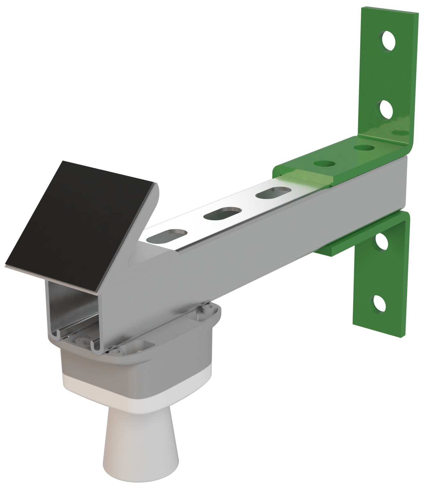
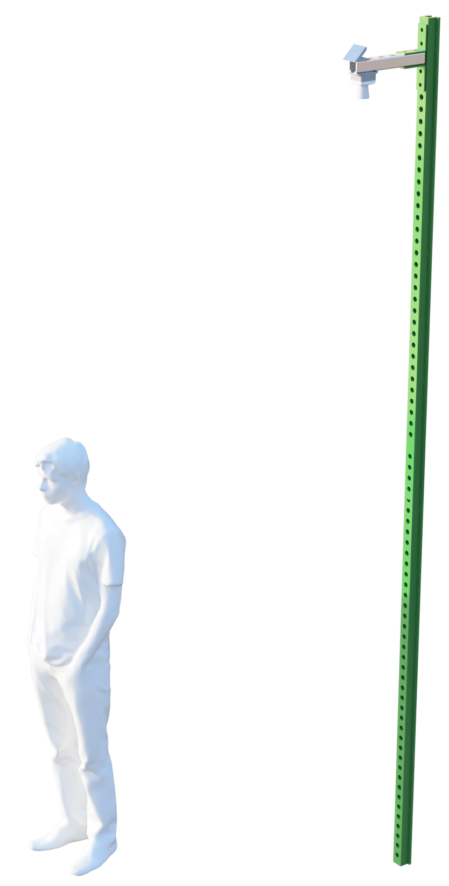
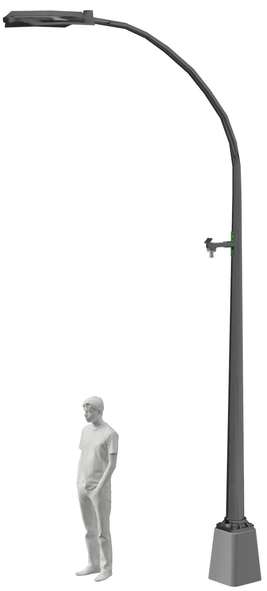

# Mounting hardware
The FloodNet sensor uses readily available hardware for mounting to a variety of street infrastructure. The sensor alone weighs **0.5lb** and the complete assembly including mounting hardware weighs **3lbs**. The typical mounting condition consists of the sensor itself bolted to the underside of a 1 5/8" aluminum strut channel. Aluminum was chosen to reduce the overall load on the cantilever. The 3D printed solar panel is bolted to the top of the strut channel and can be rotated for optimizing sunlight pickup. The mounting hardware can adapt to various conditions.

The most common mounting option is bolted to a U-channel at **>10ft** from the ground. See image below.

The sensor can be mounted to light poles of varying diameter using 300lb steel strapping. The ultrasonic sensors used to detect flood depth typically have a maximum range of 16ft but 32ft models can be added. Light pole mounting on the light overhang would likely require 32ft ultrasonic sensors. See image below for a vertical light mount scenario.

