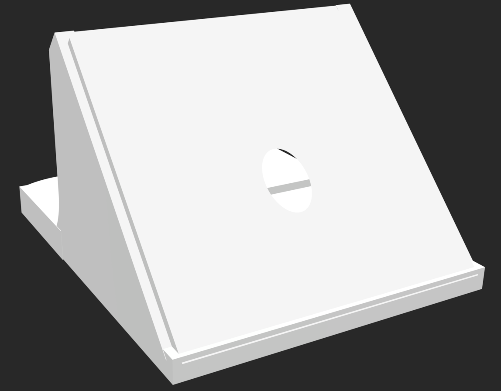
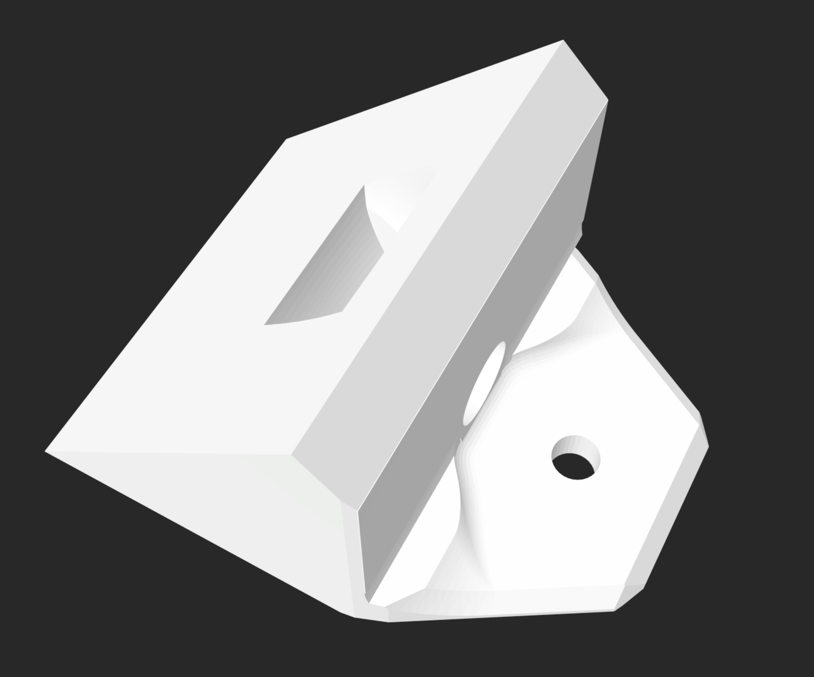
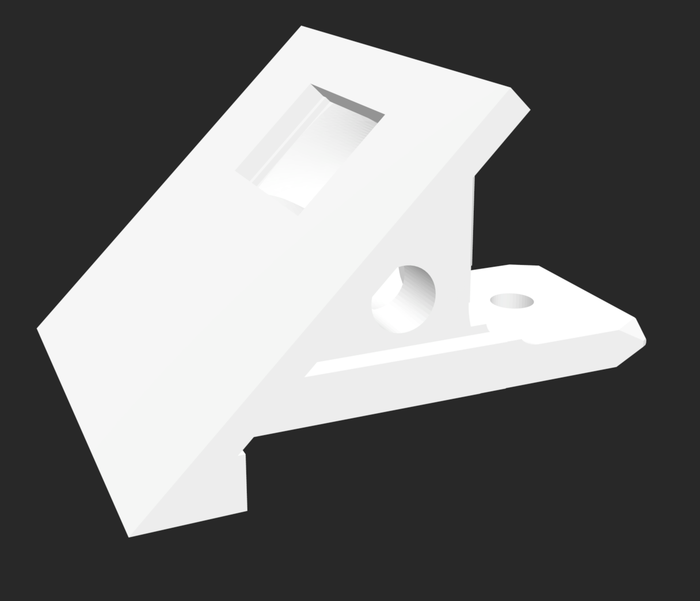

# Design Currently in Field 

The design currently being utilized in the field offers great flexibility with it's compact size. However, repeated use in the field has exposed major shortcomings that have hindered sensor installations from going as smoothtly as possible. For starters, the overhang over the base of the sensor makes it hard to screw in. This feat is difficult as it is due to it being done on a ladder 6 feet off the ground. Having to use an angled drill at the same time does very little to alleviate the difficulty level. In addition, several failure analyses performed on sensors that stopped working in the field have revealed the root cause to be the solar panel becoming disconnected from the solar cable. When handling the solar panels during installation, it is very easy to tug on the cable more aggresively than intended, thus allowing for wires to become disconnected from the panel. 

# Version 1

The first proposed revision of the original solar panel mount primarily addresses the concerns in screwing down the base. By extending the base of the solar panel mount out further, the electric drill can now be used straight down instead of at an angle. Although extending the base makes it easier to screw down the base, it also introduces an abundance of material to the design. When 3D printing, an important thing to keep in mind is how much material and support your design will need. The more you need, the longer it takes to complete a print and the less cost friendly it will be. 

Upon printing out the first version, the solar panel mount was noticeably more bulkier. Even putting aside the cost and time, a bulkier design would be more cumbersome to transport. Furthermore, there was still a lack of cable tension support for the strain behind the panel. 

Needless to say, there was alot more work to be done. 

# Version 2

The second version of the solar panel mount addresses the lack of cable tension support in the previous iterations. In an attempt to help ease the pull directly behind the solar panel, the hole through which the solar port cable is looped through was moved lower down towards the base. 

In doing so, while there was less strain present directly behind the solar panel new strain was introduced elsewhere. Specifically, between the cable coming out of it's hole towards the base. Moreover, another issue that was becoming increasingly prevalent out in the field was how the cable coming out over the base of the mount often obstructed screwing down the base. If special attention wasn't paid to pushing the cable over to the side, it got caught up in the wingnut. 

The solar panel mount was still considerably bulkier than necessary. Attempts to shave down the sides of the base were made using the chamfer function in Fusion360. Despite, making some difference the mount was still too heavy to be practical out in the field.  

# Final Version

The potential final design of the solar panel mount takes a slightly different approach in addressing cable tension concerns. Instead of having the solar port cable come out from the back of the mount, it now comes out from the side. This in turn results in an almost 90 degree bend internally before the cable comes out, getting rid of the tension directly on the back of the solar panel. This also rectifies the issue of the solar port cable getting caught up on the wingnut at the base of the mount. 

Most importantly, however, is that the solar panel mount is signifcantly less heavy! Cutting out huge chunks from the sides of the mount leads to a more transportable and manageable design. The sturdiest component of the mount should be the base as that is the part that will undergo the most pressure out in the field. Other parts of the mount do not need to be as robust. 

As of right now, this version of the solar panel mount is undergoing lab testing. Final kinks still need to be worked out such as whether there should be two holes, one on each side for the solar port cable to be looped out from, and what the best orientation for 3D printing is. 

