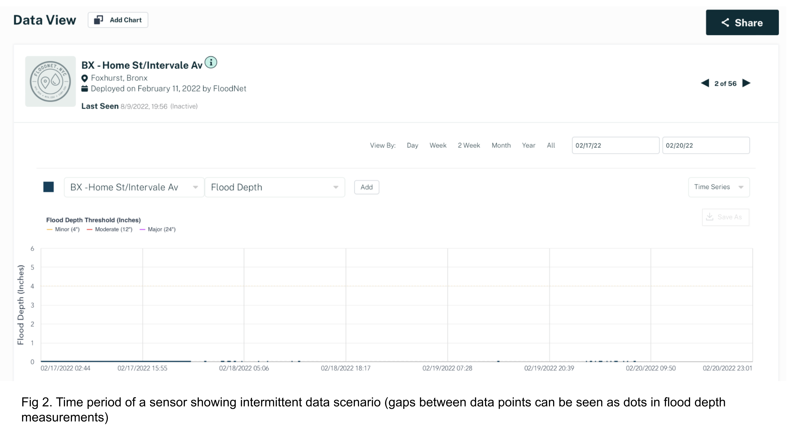

- [Maintenance playbook](#maintenance-playbook)
	- Section 0. Common visit reasons checklist **(Pre-visit)**	
	- Section 1. Assessment **(Pre-visit)**
	- Section 2. Planning **(Pre-visit)**
		* 2.1 Planning when the gateway is down?
		* 2.2 Planning for sensors with a down-trending battery profile
		* 2.3 Planning for sensors with a no charging trend profile
		* 2.4 Planning for sensors with wrong readings	
		* 2.5 Planning for sensors with high packet-loss	
		* 2.6 Planning for sensors that have abruptly stopped working	
	- Section 3. Packing necessary equipment and tools **(Pre-visit)**	
	- Section 4. Repair procedures **(On-site)**	
		* 4.1 Repair procedures if the gateway is down	
		* 4.2 Repair procedures for sensors that have abruptly stopped working	
		* 4.3 Repair procedures for sensors with a down-trending battery profile	
		* 4.4 Repair procedures for sensors with a no charging trend profile	
		* 4.5 Repair procedures for sensors with wrong readings
		* 4.6 Repair procedures for sensors with high packet-loss
	- Section 5. Check and validate the sensor operation
	- Section 6. Challenges in the field **(On-site)**
		* 6.1 No coverage/Sensor not joining the network
		* 6.2 Sensor joined the network but I don’t see any data on the dashboard
		* 6.3 Debugging in the field
		* 6.4 Vandalism

# Maintenance playbook

This playbook details the steps for in-person maintanance visits to perform quick, reliable, and quality sensor repairs.

Use the following thinker roadmap to understand the stages broken down into two categories based on the location of action to be taken
 

 

## Section 0. Common visit reasons checklist (Pre-visit)	
Before a maintenance visit, speculation about the underlying problem deduced from each particular sensor's latest distance and battery data is very helpful for systematic planning of maintenance visits.

The following is a list of commonly observed scenarios causing a sensor to go offline:
- The nearest gateway is down
- The nearest gateway is operational but the sensor has abruptly stopped working
- Wrong readings 
-  Constantly reading a new inaccurate height
- Sensor readings jump between two values
- Erroneous sensor readings with unusual anomalies
- High Packet-loss; most of the sensor uplinks are missing; packet loss % > 20
- The sensor has stopped working due to a down-trending battery profile (battery charge-discharge cycles are observed but can't keep up)
- The sensor has stopped working due to no charge trend observed at all (no battery charge-discharge cycles observed)

## Section 1. Assessment (Pre-visit)
Check the [Data dashboard](https://dataviz.floodnet.nyc), for: 

1. **Intermittent data:**
	If only one sensor in the area has a problem, it likely has connectivity issues - fix is to replace the antenna or even swap it with a new sensor. Refer to section 2.2: Planning for sensors that have abruptly stopped working and section 2.6: Planning for sensors with high packet-loss.
	The below image shows the scenario with intermittent sensor data 
	
	Below is an image, showing previously vandalized floodsensor with the antenna broken
	
	Else, if all the sensors in the area have issues at the same time, the g/w needs some fixing. Refer to section 2.1: Planning when the gateway is down?

2. **Sensor last seen:**
	Date last seen. If time is greater than three hours it is likely that the sensor is down. Antenna could be totally damaged. To check the date last seen of a sensor click on its corresponding dot and a pop-up will show like the one in the figure below.
	
	Refer to section 2.6: Planning for sensors that have abruptly stopped working and section 2.3: Planning for sensors with a down-trending battery profile. If the solar panel has been vandalized, FloodNet members can verify that the battery trend has been in the fall.
	Below image shows previously vandalized floodsensor with a missing solar panel.
	

3. **Noisy data:**
	If the sensor data seems to be noisy or wrong, for planning refer to section 2.5: Planning for sensors with wrong readings

	For any other unidentified or abrupt issues Email FloodNet folks - [Charlie](mailto:cmydlarz@nyu.edu), [Bea](mailto:bs3639@nyu.edu), and [Praneeth](mailto:pc3305@nyu.edu) to check on sensor/server/status etc on the back-end internally.

## Section 2. Planning (Pre-visit)
The corresponding repair procedures for the below sections are listed in section 4: Repair procedures (On-site).

### 2.1 Planning when the gateway is down?
To conclude that the gateway seems offline, confirm that all the sensors within a mile radius to this gateway are offline. Contact the FloodNet team to confirm this and proceed with further steps.

Couple of reasons a gateway could go offline:
1. Disconnected power
2. Damaged gateway and/or antenna

### 2.2 Planning for sensors with a down-trending battery profile
The figure below shows a selected period of 8 days where the battery trends down but trends back up. 

And, the figure below shows a comparison of a normal trend with downward battery trend.

One of the reasons for a down-trending battery profile is insufficient solar power being harvested, or introduction of a new obstacle that has been blocking the solar panel. If this seems to be the case upon inspection, the solar panel alone shall be shifted, if possible, to a different mounting location on the same post facing the direction South. And the sensor can be left in the same place for sensing operations.

Suppose none of the above options seem feasible. This particular sensor shall be relocated to the nearest possible mounting location, ideally in the same street or one that covers the same flooding hotspot. If the relocation of the solar panel is not possible, the duty cycle of the sensor can be reduced to conserve power and keep up with the battery-drain charge cycles. Contact FloodNet team members to perform the duty cycle change.

Upon in-person sensor inspection, an engineer can only deduce the actual cause of a down-trending battery profile. Hence for efficient use of on-ground time, if needed, a new potential deployment for relocation shall be scouted before the maintenance visit regardless of the speculation.

Engineer shall carry the following and swap wherever necessary:

- A sensor to swap
- Sensor spare parts 
- A battery
- An antenna
- Solar panel with mount and cable

### 2.3 Planning for sensors with a no charging trend profile
A no charging scenario has no observable highs or lows in the battery charge-discharge cycles but has a smooth overall battery trend down. This means that the sensor’s solar power harvesting system has failed. This can be due to:

1. Panel failure 
2. Failed electrical connections/components

Both the cases require laboratory debugging; hence a new spare sensor shall be used to swap the faulty sensor. The `deployment_id` shall be the same but the `dev_id` should be a new and a unique one for the spare sensor. Contact FloodNet team members to proceed with this step.

### 2.4 Planning for sensors with wrong readings
Inaccurate readings can be due to one or any combination of the following:

- Damaged ultrasonic sensor
- Parked bikes underneath
- Parked cars underneath
- Newsstand
- Parked Cars
- Spiderwebs
- Trash bags
- Obstacles
- Weeds and dirt
- Damaged or distorted signpost 

In the case of a damaged sensor or an electrical failure, the sensor distance readings would always be 0 mm. On the other hand, if the sensor distance reading is not a zero but 300 mm, this could be due to an obstacle within 30 centimeters of the sensor cone, which is obstructing the sensing pulse, for example, a spiderweb or a newly grown branch, etc. In the former case, if there is any physical damage, the whole unit shall be swapped with a new one as it needs further in-house repairs. If cleaning the insides of the cone is not sufficient, the sensor shall be swapped with a new unit.

Like in the image below, weeds that grow in the sidewalk cracks and the dirt accumulated directly beneath the sensor can lead to inaccurate or 5000 mm or 10000 mm (no return) distance measurements. Cleaning/re-working the surface beneath the sensor can solve this problem. For the sensor to perform its best, the surface underneath shall be concrete and a flat surface.

Signpost damage or distortion after a sensor deployment changes the angle at which the sensor measures the distance to the surface beneath it. For a typical height of 2700 mm on a signpost, a change in 10° angle can alter the sensor measurements by mod|2700 - 2700*sec(10°)| mm, which is 41.7 mm (1.65 inches). To re-calibrate the sensor, the mounting hardware shall be readjusted using a spirit level to align the mount perfectly horizontally to the earth’s surface below(due to gravity, the water body's surface is horizontal). This can be performed by stacking spare washers between the mounting and its screws on the signpost. 

In some cases, the distortion of the pole might be beyond a significant angle which is impractical for the recalibration of the sensor; the sensor shall be relocated to the following closest optimal mounting location. Additionally, for maintenance, DOT can be informed about the damaged signpost.

### 2.5 Planning for sensors with high packet-loss	
The figure in section 1 shows a scenario of a sensor with high-packet loss percentage. Simply meaning the data is intermittent and missing(can be observed as dots or empty gray lines on the [dashboard](https://dataviz.floodnet.nyc)). Following are some reasons and fixes for sensors with high packet loss percentage:

- Upgrading/Replacing the antenna
- Nearest gateway not within ideal range - Consider new gateway options
- Swapping with a new unit boosted to the maximum radio power and optimal frequencies in compliance with FCC. Contact FloodNet for further assistance.

### 2.6 Planning for sensors that have abruptly stopped working
Reasons for a sensor to abruptly stop working are:

- Compromised waterproofing
- Sensor brownout
- Physical Damage
- Theft or Vandalism
- Sensor failure

Engineer shall carry the following and swap wherever necessary:

1. A sensor to swap because it is most likely that the sensor would need an in-laboratory inspection if none of the sections 2.1, 2.2, 2.3, 2.4, 2.5 and 2.6 applies.
2. Sensor spare parts comes in handy:
3. A battery
4. An antenna
5. A spare Solar panel with mount and cable

## Section 3. Packing necessary equipment and tools (Pre-visit)	
Using the information from section 2, an estimate of the number of sensor units needed for swapping can be made. Spare sensor parts such as antenna, solar panel, and batteries shall be carried as well. Below is a comprehensive and precise list of tools, spares, and everything needed for repairing sensors:

**Checklist:**

| No. |                 Part name                 | Qty needed per sensor |
|:---:|-------------------------------------------|:---------------------:|
|  1  | Electric screwdriver + attachments        |           -           |
|  2  | Signage                                   |           1           |
|  3  | Safety vests                              |           -           |
|  4  | Safety hats                               |           -           |
|  5  | Wire cutter                               |           -           |
|  6  | Pliers                                    |           -           |
|  7  | Adjustable wrench                         |           -           |
|  8  | Socket adapters                           |           -           |
|  9  | Hex Head Screws M6 or 1/4"-20 (1½” long)  |           2           |
|  10 | Hex Head Screws M6 or 1/4"-20 (4” long)   |           2           |
|  11 | Hex lock nuts M6 or 1/4"-20               |           2           |
|  12 | Hex Head Screw M8 or 5/16” (1½” long)     |           2           |
|  13 | Hex Head Screw M8 or 5/16” (4” long)      |           2           |
|  14 | Hex lock nuts M8 or 5/16”                 |           2           |
|  15 | M6 socket Head screws                     |           2           |
|  16 | Oversized Clipped Washers                 |           8           |
|  17 | Strut channel nuts                        |           1           |
|  18 | Strut channel 1 ft - Aluminum             |           1           |
|  19 | Wing nuts - M6                            |           1           |
|  20 | Oversized split washers                   |           4           |
|  21 | Fliers and/or post cards                  |           -           |
|  22 | Sandwich board                            |           -           |
|  23 | A-frame ladder                            |           -           |
|  24 | Spare batteries                           |           1           |
|  25 | Flash light                               |           -           |
|  26 | Long socket attachment - 1/4”             |           -           |
|  27 | Long socket attachment - 5/16”            |           -           |
|  28 | Long socket attachment - 7/16”            |           -           |
|  29 | Long socket attachment - 9/16”            |           -           |
|  30 | Long socket attachment - 1/2”             |           -           |
|  31 | Wrench - 1/4”                             |           -           |
|  32 | Wrench - 5/16”                            |           -           |
|  33 | Wrench - 7/16”                            |           -           |
|  34 | Wrench - 9/16”                            |           -           |
|  35 | Wrench - 1/2”                             |           -           |
|  36 | Spare antennas                            |           1           |
|  37 | Flat mending plate                        |           1           |
|  38 | L-bracket                                 |           1           |
|  39 | Zip Ties                                  |           1           |
|  40 | Spare assembled solar panel with cable    |           1           |
|  41 | Provisioned and tested flood sensor       |           1           |
|  42 | Circular bubble level                     |           -           |

## Section 4. Repair procedures (On-site)	
### 4.1 Repair procedures if the gateway is down	
**Things to try:**

- Make sure that the power supply is present.
- Reset the power supply by unplugging and plugging back the g/w power cable.
- Checking internet connectivity. FloodNet gateways are cellular and/or ethernet connected. 
- Check the Antenna and/or it’s cable for any damages
- Try swapping the gateway and/or it’s antenna with new ones
- For Gateway maintenance, contact FloodNet team for further assistance.

### 4.2 Repair procedures for sensors with a down-trending battery profile	
**Things to try:**

- Swap the battery and solar panel. 
	
	To perform a battery swap, the sensor shall be taken down and opened using a philips screwdriver. To swap the solar panel, unplug the solar cable by twisting the connector anti-clockwise and replace it with a new one. Remount the sensor and zip tie the excess solar cable into the struct channel. Make sure the sensor power switch is turned ON after remounting the sensor on the signpost. 

### 4.3 Repair procedures for sensors with a no charging trend profile	
In this case, the sensor hardware requires laboratory debugging; hence a new spare sensor shall be used to swap the faulty sensor. Contact FloodNet for further assistance.

### 4.4 Repair procedures for sensors with wrong readings
**Things to try:**

- Cleaning the insides of the sensor cone using a soft dry cloth. 
- Clear any obstructions in the way, i.e. between the sensor and the surface it is mounted over. Make sure nothing is present within 2-3 ft. vicinity, on the side of the post that the sensor is mounted
- Removing any weeds or debris on the surface beneath the sensor
- Reworking the concrete surface beneath the sensor
- Check for any signpost damage - twisted or bent. To verify this, place a spirit level on the mounting of the FloodNet’s flood sensor and check for any deviation from the horizontal ground surface. This has been perfectly aligned parallel to the horizontal ground (earth’s surface, not the sidewalk) during the installation. Realign by stacking spare washers.

### 4.5 Repair procedures for sensors with high packet-loss
If the sensor data is patchy, most likely the network isn’t strong enough. Consider new gateway options nearby. 

If the sensor previously worked well but stopped, it must be the antenna (assuming gateway is operational).  

**Things to try:**

- Swap the antenna. To swap the antenna the sensor need not be taken down, the antenna can be replaced externally using a ladder by unscrewing the older antenna and screwing in a new antenna.

**Steps:**

1. For performing only the antenna swap, unmounting the sensor is not necessary. This can be done externally by undoing the older antenna using a ladder, and screwing a new one as a replacement.
2. Finally, check the dashboard for data if this worked
3. If this hasn’t worked, a sensor swap is needed
4. If you find that the interior antenna cable or the antenna socket of the MCU board is totally damaged, a laboratory repair is needed. Retrieve the sensor and contact FloodNet for in-house repair.

### 4.6 Repair procedures for sensors that have abruptly stopped working
**Things to try:**

- Reset the sensor by pressing the sensor push button to OFF position and ON again. ON position is when the push button is held in. There should be a green LED light visible when the sensor is turned on successfully. Wait for the Green LED to go away, which happens when the sensor successfully connects to the network and is online.
- Swap the battery. To perform a battery swap, the sensor shall be taken down and opened using a philips screwdriver. 
- Swap the antenna. To swap the antenna the sensor need not be taken down, but first turn the sensor OFF by pressing the push button. Then, the antenna can be replaced externally using a ladder by unscrewing the older antenna and screwing in a new antenna. When completed do not forget to turn ON the sensor back and wait for it to connect to the network.
- Swap the solar panel

## Section 5. Check and validate the sensor operation

**Steps:**

1. To check the sensor operation, turn ON the sensor by pressing the power button beneath the sensor. 
2. After turning on the sensor successfully, wait for the LED to turn green, which means the sensor is attempting to join the network. The LED goes off when the sensor joins the network and is online. If you see that the LED stays on, make sure the Antenna is screwed in properly and it feels secure.
3. If LED doesn’t turn green at all, check if Battery likely dead or disconnected from PCB socket and check whether the CubeCell power connector is connected to the screw terminals
4. Finally, check the [dashboard](https://dataviz.floodnet.nyc) for data
5. If none of the above worked, swap the sensor with a new one, retrieve the old sensor and contact FloodNet for further in-house repairs. 

## Section 6. Challenges in the field (On-site)
### 6.1 No coverage/Sensor not joining the network
Sometimes the sensor takes a while to pick up the gateway, usually a few minutes. If certain about the gateway being in range and online, the sensor can be turned on and deployed. 

If there seems to be no coverage, deployment in that particular flooding hotspot can be considered for relocation, or even better, a new gateway in the vicinity for better coverage. 

### 6.2 Sensor joined the network but I don’t see any data on the dashboard
This is the case where the sensor has joined the network after maintenance, i.e. after turning the sensor ON the green LED light has been observed and shortly it went off, however no new data has been seen on the dashboard, contact FloodNet to confirm the absence of the sensor traffic on the backend internally. Failed uplinks are due to low signal strength or higher noise levels. Allowing the sensor to settle for a few minutes can help. Make a note for further assessment of network coverage.

### 6.3 Debugging in the field
Debugging in the field is usually not efficient. Nevertheless if needed, the maintenance shall be done under the presence or guidance of an expert sensor technician. 

### 6.4 Vandalism
Community Engagement in that neighborhood and the signage installed along with the sensor can nurture a positive community comprehension by explaining the purpose, privacy concerns, and information about the project. 
Nevertheless, in the case of theft or vandalism, the sensor can be either replaced if the mounting location is not within reachable heights by a 6 feet person from the ground or considered for a relocation.
